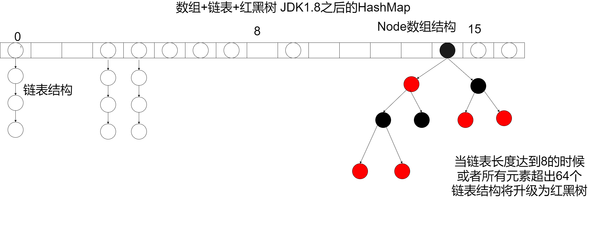
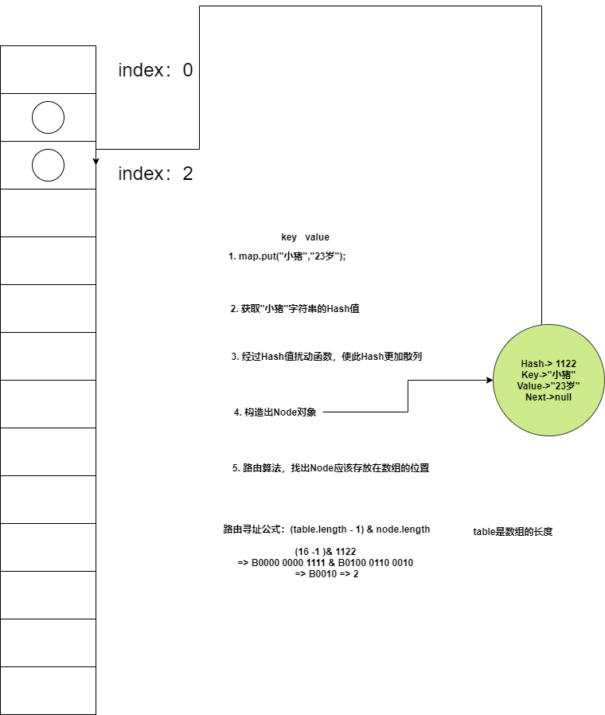

# 什么是哈希
Hash也称散列、哈希，对应的英文都是Hash。基本原理就是把任意长度的输入，通过Hash算法变成固定长度的输出。
这个映射的规则就是对应的Hash算法，而原始数据映射后的二进制串就是哈希值。

Hash的特点：
1.从hash值不可以反向推导出原始的数据
2.输入数据的微小变化会得到完全不同的hash值，相同的数据会得到相同的值
3.哈希算法的执行效率要高效，长的文本也能快速地计算出哈希值
4.hash算法的冲突概率要小

由于hash的原理是将输入空间的值映射成hash空间内，而hash值的空间远小于输入的空间。
根据抽屉原理，一定会存在不同的输入被映射成相同输出的情况。

抽屉原理：桌上有十个苹果，要把这十个苹果放到九个抽屉里，无论怎样放，我们会发现至少会有一个抽屉里面放不少于两个苹果。这一现象就是我们所说的“抽屉原理”。

# HashMap

HashMap底层就数据结构主要是数组+链表+红黑树组成，链表则是主要为了解决哈希冲突，如果遇到哈希冲突的情况，他就会往链表中添加数据，如果你的链表长度超过了8并且size超过了64就会转换成红黑树。

先说说HashMap的创建吧，如果没有指定长度的话，他默认是16，指定的话也必须要为2的N次方

  

## HashMap的继承体系是什么样的？
HashMap继承了AbstractMap，实现了Cloneable接口、Serializable接口、Map<K,V>接口

## 什么是Hash碰撞？
假如我有存储一个元素，发现其Key的Hash值还是1122，那么经过扰动之后，其位置还是2，所以此时，就有冲突，这个时候就要解决冲突。

解决Hash碰撞的方法

开放寻址法
拉链法 [HashMap就是使用了此方法]

## jdk8为什么引入红黑树？
在JDK1.7之前，假如数据量很大，那么碰撞的概率也很大，此时，拉链法的链子就会很长，那么就会降低查找速度
所以在JDK1.8之后引入红黑树

## HashMap的PUT

先说在设置数组之前，会先初始化数组，首先根据 key 的值通过扰动函数计算 hash 值，通过hash&（length-1）进行取模运算得到你的下标，找到数组的下标之后又回看的key是不是存在的，存在呢就覆盖掉value，如果key不重复就继续看下面的节点是不是红黑树是就挂上去，如果是链表就会添加到链表上，然后还会判断你这个链表长度是不是大于了8，是的话就会把这个链表转换成红黑树

设置完成之后呢他通过HashMap的容量去判断一下是不是大于了临界值，（临界值的算法默认是数组length*负载因子 默认负载因子是0.75）

 

## HashMap扩容原理？
当当前数组的size大于临界值会开始扩容（临界值计算数组的长度*0,75），  HashMap的扩容默认长度是原来长度的2倍，他会创建一个新的数组，创建完成会把当前数组的节点数据赋值到新的数组，如果节点是链表的话还要进行高低位运算，如果是低位的他依旧会存储在当前的位置，如果是高位的他就给会存储到当前index+旧数组的length

## 红黑树

自平衡二叉查找树，每个节点要么是黑色要么是红色，他主要是通过左子树和右子树的黑结点的层数是相等去达到一个平衡

 达到平衡的三种操作：左旋、右旋和变色。

1.变色：结点的颜色由红变黑或由黑变红。

2.左旋：以某个结点作为支点(旋转结点)，其右子结点变为旋转结点的父结点，右子结点的左子结点变为旋转结点的右子结点，左子结点保持不变。

3.右旋：以某个结点作为支点(旋转结点)，其左子结点变为旋转结点的父结点，左子结点的右子结点变为旋转结点的左子结点，右子结点保持不变

### 红黑树的性质

性质1：每个节点要么是黑色，要么是红色。

性质2：根节点是黑色。

性质3：每个叶子节点（NIL）是黑色。

性质4：每个红色节点的两个子节点一定都是黑色。

不能有两个红色节点相连。

性质5：任意一节点到每个叶子节点的路径都包含数量相同的黑结点。俗称：黑高！

从性质5又可以推出：

性质5.1：如果一个节点存在黑子节点，那么该结点肯定有两个子节点