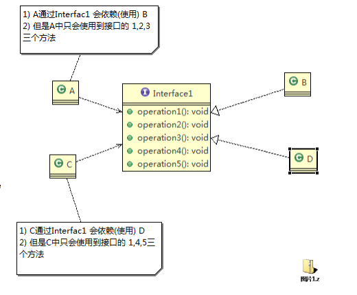

设计模式原则，其实就是程序员在编程时，应当遵守的原则，也是各种设计模
式的基础(即：设计模式为什么这样设计的依据)

设计模式常用的七大原则有:
1) 单一职责原则
2) 接口隔离原则
3) 依赖倒转(倒置)原则
4) 里氏替换原则
5) 开闭原则
6) 迪米特法则
7) 合成复用原则

## 单一职责原则
对类来说的，即一个类应该只负责一项职责。如类A负责两个不同职责：职责1，职责2。
当职责1需求变更而改变A时，可能造成职责2执行错误，所以需要将类A的粒度分解为
A1，A2

### 单一职责原则注意事项和细节

1) 降低类的复杂度，一个类只负责一项职责。
2) 提高类的可读性，可维护性
3) 降低变更引起的风险
4) 通常情况下，我们应当遵守单一职责原则，只有逻辑足够简单，才可以在代码级违
反单一职责原则；只有类中方法数量足够少，可以在方法级别保持单一职责原则

### 代码示例

```` java

````

## 接口隔离原则(Interface Segregation Principle)




1) 客户端不应该依赖它不需要的接口，即一个类对另一个类的依赖应该建立在最小的接口上

2) 类A通过接口Interface1依赖类B，类C通过接口Interface1依赖类D，如果接口Interface1对于类A和类C来说不是最小接口，那么类B和类D必须去实现他们不需要的方法。

3) 按隔离原则应当这样处理：将接口Interface1拆分为独立的几个接口，类A和类C分别与他们需要的接口建立依赖关系。也就是采用接口隔离原则

## 依赖倒转原则

1) 高层模块不应该依赖低层模块，二者都应该依赖其抽象
2) 抽象不应该依赖细节，细节应该依赖抽象
3) 依赖倒转(倒置)的中心思想是面向接口编程
4) 依赖倒转原则是基于这样的设计理念：相对于细节的多变性，抽象的东西要稳定的多。以抽象为基础搭建的架
构比以细节为基础的架构要稳定的多。在 java 中，抽象指的是接口或抽象类，细节就是具体的实现类
5) 使用接口或抽象类的目的是制定好规范，而不涉及任何具体的操作，把展现细节的任务交给他们的实现类去完
成