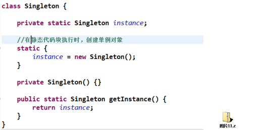
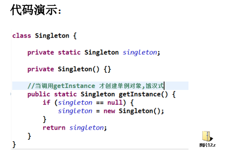
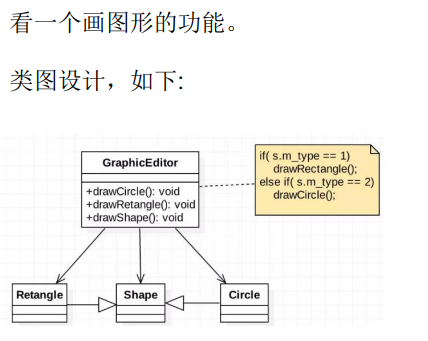
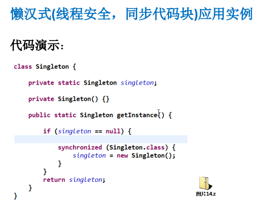

所谓类的单例设计模式，就是采取一定的方法保证在整个的软件系统中，对某个类
只能存在一个对象实例，并且该类只提供一个取得其对象实例的方法(静态方法)。

比如Hibernate的SessionFactory，它充当数据存储源的代理，并负责创建Session
对象。SessionFactory并不是轻量级的，一般情况下，一个项目通常只需要一个
SessionFactory就够，这是就会使用到单例模式。

## 单例设计模式八种方式
1) 饿汉式(静态常量)
2) 饿汉式（静态代码块）
3) 懒汉式(线程不安全)
4) 懒汉式(线程安全，同步方法)
5) 懒汉式(线程安全，同步代码块)
6) 双重检查
7) 静态内部类
8) 枚举

##  饿汉式(静态常量)

1) 构造器私有化 (防止 new )
2) 类的内部创建对象
3) 向外暴露一个静态的公共方法。getInstance
4) 代码实现

````java
package com.atguigu.singleton.type1;

public class SingletonTest01 {

	public static void main(String[] args) {
		//测试
		Singleton instance = Singleton.getInstance();
		Singleton instance2 = Singleton.getInstance();
		System.out.println(instance == instance2); // true
		System.out.println("instance.hashCode=" + instance.hashCode());
		System.out.println("instance2.hashCode=" + instance2.hashCode());
	}

}

//饿汉式(静态变量)

class Singleton {
	
	//1. 构造器私有化, 外部能new
	private Singleton() {
		
	}
	
	//2.本类内部创建对象实例
	private final static Singleton instance = new Singleton();
	
	//3. 提供一个公有的静态方法，返回实例对象
	public static Singleton getInstance() {
		return instance;
	}
	
}
````

### 优缺点说明：
1) 优点：这种写法比较简单，就是在类装载的时候就完成实例化。避免了线程同
步问题。
2) 缺点：在类装载的时候就完成实例化，没有达到Lazy Loading的效果。如果从始
至终从未使用过这个实例，则会造成内存的浪费
3) 这种方式基于classloder机制避免了多线程的同步问题，不过，instance在类装载
时就实例化，在单例模式中大多数都是调用getInstance方法， 但是导致类装载
的原因有很多种，因此不能确定有其他的方式（或者其他的静态方法）导致类
装载，这时候初始化instance就没有达到lazy loading的效果
4) 结论：这种单例模式可用，可能造成内存浪费


### 饿汉式（静态代码块)



### 优缺点说明：
1) 这种方式和上面的方式其实类似，只不过将类实例化的过程放在了静态代码块
中，也是在类装载的时候，就执行静态代码块中的代码，初始化类的实例。优
缺点和上面是一样的。
2) 结论：这种单例模式可用，但是可能造成内存浪费

### 懒汉式(线程不安全)


1) 起到了Lazy Loading的效果，但是只能在单线程下使用。
2) 如果在多线程下，一个线程进入了if (singleton == null)判断语句块，还未来得及
往下执行，另一个线程也通过了这个判断语句，这时便会产生多个实例。所以
在多线程环境下不可使用这种方式
3) 结论：在实际开发中，不要使用这种方式.

### 懒汉式(线程安全，同步方法)


1) 解决了线程不安全问题
2) 效率太低了，每个线程在想获得类的实例时候，执行getInstance()方法都要进行
同步。而其实这个方法只执行一次实例化代码就够了，后面的想获得该类实例，
直接return就行了。方法进行同步效率太低
3) 结论：在实际开发中，不推荐使用这种方式

### 懒汉式(线程安全，同步代码块)


1) 这种方式，本意是想对第四种实现方式的改进，因为前面同步方法效率太低，
改为同步产生实例化的的代码块
2) 但是这种同步并不能起到线程同步的作用。跟第3种实现方式遇到的情形一
致，假如一个线程进入了if (singleton == null)判断语句块，还未来得及往下执行，
另一个线程也通过了这个判断语句，这时便会产生多个实例
3) 结论：在实际开发中，不能使用这种

## 双重检查

````java
package com.atguigu.singleton.type6;


public class SingletonTest06 {

	public static void main(String[] args) {
		System.out.println("双重检查");
		Singleton instance = Singleton.getInstance();
		Singleton instance2 = Singleton.getInstance();
		System.out.println(instance == instance2); // true
		System.out.println("instance.hashCode=" + instance.hashCode());
		System.out.println("instance2.hashCode=" + instance2.hashCode());
		
	}

}

// 懒汉式(线程安全，同步方法)
class Singleton {
	private static volatile Singleton instance;
	
	private Singleton() {}
	
	//提供一个静态的公有方法，加入双重检查代码，解决线程安全问题, 同时解决懒加载问题
	//同时保证了效率, 推荐使用
	
	public static synchronized Singleton getInstance() {
		if(instance == null) {
			synchronized (Singleton.class) {
				if(instance == null) {
					instance = new Singleton();
				}
			}
			
		}
		return instance;
	}
}
````

1) Double-Check 概念是多线程开发中常使用到的，如代码中所示，我们进行了两次 if (singleton == null)检查，这
样就可以保证线程安全了。
2) 这样，实例化代码只用执行一次，后面再次访问时，判断 if (singleton == null)，直接 return 实例化对象，也避
免的反复进行方法同步.
3) 线程安全；延迟加载；效率较高
4) 结论：在实际开发中，推荐使用这种单例设计模式