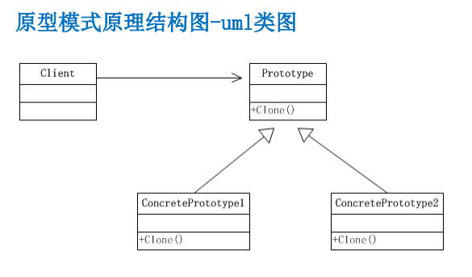

## 基本介绍

1) 原型模式(Prototype模式)是指：用原型实例指定创建对象的种类，并且通过拷
贝这些原型，创建新的对象
2) 原型模式是一种创建型设计模式，允许一个对象再创建另外一个可定制的对象，
无需知道如何创建的细节
3) 工作原理是:通过将一个原型对象传给那个要发动创建的对象，这个要发动创建
的对象通过请求原型对象拷贝它们自己来实施创建，即 对象.clone()
4) 形象的理解：孙大圣拔出猴毛， 变出其它孙大圣



1) Prototype : 原型类，声明一个克隆自己的接口
2) ConcretePrototype: 具体的原型类, 实现一个克隆自己的操作
3) Client: 让一个原型对象克隆自己，从而创建一个新的对象(属性一样)

## 浅拷贝和深拷贝

### 浅拷贝
1) 对于数据类型是基本数据类型的成员变量，浅拷贝会直接进行值传递，也就是将
该属性值复制一份给新的对象。
2) 对于数据类型是引用数据类型的成员变量，比如说成员变量是某个数组、某个类
的对象等，那么浅拷贝会进行引用传递，也就是只是将该成员变量的引用值（内
存地址）复制一份给新的对象。因为实际上两个对象的该成员变量都指向同一个
实例。在这种情况下，在一个对象中修改该成员变量会影响到另一个对象的该成
员变量值
3) 前面我们克隆羊就是浅拷贝
4) 浅拷贝是使用默认的 clone()方

````java
package com.atguigu.prototype.improve;

public class Sheep implements Cloneable {
	private String name;
	private int age;
	private String color;
	private String address = "蒙古羊";
	public Sheep friend; //是对象, 克隆是会如何处理
	public Sheep(String name, int age, String color) {
		super();
		this.name = name;
		this.age = age;
		this.color = color;
	}
	public String getName() {
		return name;
	}
	public void setName(String name) {
		this.name = name;
	}
	public int getAge() {
		return age;
	}
	public void setAge(int age) {
		this.age = age;
	}
	public String getColor() {
		return color;
	}
	public void setColor(String color) {
		this.color = color;
	}
	
	
	
	@Override
	public String toString() {
		return "Sheep [name=" + name + ", age=" + age + ", color=" + color + ", address=" + address + "]";
	}
	//克隆该实例，使用默认的clone方法来完成
	@Override
	protected Object clone()  {
		
		Sheep sheep = null;
		try {
			sheep = (Sheep)super.clone();
		} catch (Exception e) {
			// TODO: handle exception
			System.out.println(e.getMessage());
		}
		// TODO Auto-generated method stub
		return sheep;
	}
	
	
}

````


### 深拷贝
1) 复制对象的所有基本数据类型的成员变量值
2) 为所有引用数据类型的成员变量申请存储空间，并复制每个引用数据类型成员变
量所引用的对象，直到该对象可达的所有对象。也就是说，对象进行深拷贝要对
整个对象进行拷贝
3) 深拷贝实现方式1：重写clone方法来实现深拷贝
4) 深拷贝实现方式2：通过对象序列化实现深拷贝(推荐)

````java
package com.atguigu.prototype.deepclone;

import java.io.Serializable;

public class DeepCloneableTarget implements Serializable, Cloneable {
	
	/**
	 * 
	 */
	private static final long serialVersionUID = 1L;

	private String cloneName;

	private String cloneClass;

	//构造器
	public DeepCloneableTarget(String cloneName, String cloneClass) {
		this.cloneName = cloneName;
		this.cloneClass = cloneClass;
	}

	//因为该类的属性，都是String , 因此我们这里使用默认的clone完成即可
	@Override
	protected Object clone() throws CloneNotSupportedException {
		return super.clone();
	}
}

````

````java
package com.atguigu.prototype.deepclone;

import java.io.ByteArrayInputStream;
import java.io.ByteArrayOutputStream;
import java.io.ObjectInputStream;
import java.io.ObjectOutputStream;
import java.io.Serializable;

public class DeepProtoType implements Serializable, Cloneable{
	
	public String name; //String 属性
	public DeepCloneableTarget deepCloneableTarget;// 引用类型
	public DeepProtoType() {
		super();
	}
	
	
	//深拷贝 - 方式 1 使用clone 方法
	@Override
	protected Object clone() throws CloneNotSupportedException {
		
		Object deep = null;
		//这里完成对基本数据类型(属性)和String的克隆
		deep = super.clone(); 
		//对引用类型的属性，进行单独处理
		DeepProtoType deepProtoType = (DeepProtoType)deep;
		deepProtoType.deepCloneableTarget  = (DeepCloneableTarget)deepCloneableTarget.clone();
		
		// TODO Auto-generated method stub
		return deepProtoType;
	}
	
	//深拷贝 - 方式2 通过对象的序列化实现 (推荐)
	
	public Object deepClone() {
		
		//创建流对象
		ByteArrayOutputStream bos = null;
		ObjectOutputStream oos = null;
		ByteArrayInputStream bis = null;
		ObjectInputStream ois = null;
		
		try {
			
			//序列化
			bos = new ByteArrayOutputStream();
			oos = new ObjectOutputStream(bos);
			oos.writeObject(this); //当前这个对象以对象流的方式输出
			
			//反序列化
			bis = new ByteArrayInputStream(bos.toByteArray());
			ois = new ObjectInputStream(bis);
			DeepProtoType copyObj = (DeepProtoType)ois.readObject();
			
			return copyObj;
			
		} catch (Exception e) {
			// TODO: handle exception
			e.printStackTrace();
			return null;
		} finally {
			//关闭流
			try {
				bos.close();
				oos.close();
				bis.close();
				ois.close();
			} catch (Exception e2) {
				// TODO: handle exception
				System.out.println(e2.getMessage());
			}
		}
		
	}
	
}
````

## 原型模式的注意事项和细节
1) 创建新的对象比较复杂时，可以利用原型模式简化对象的创建过程，同时也能够提
高效率
2) 不用重新初始化对象，而是动态地获得对象运行时的状态
3) 如果原始对象发生变化(增加或者减少属性)，其它克隆对象的也会发生相应的变化，
无需修改代码
4) 在实现深克隆的时候可能需要比较复杂的代码
5) 缺点：需要为每一个类配备一个克隆方法，这对全新的类来说不是很难，但对已有
的类进行改造时，需要修改其源代码，违背了ocp原则