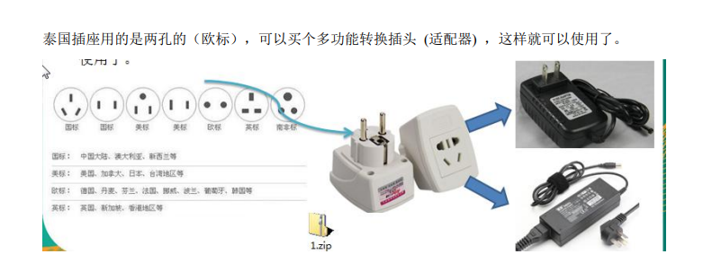
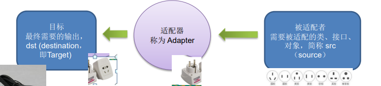
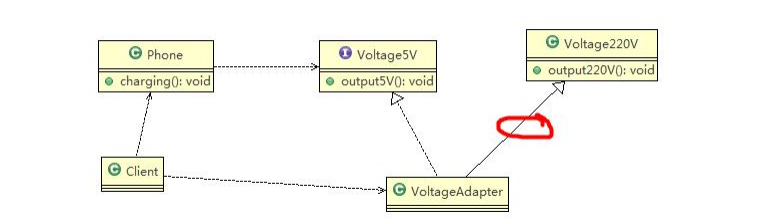

## 现实生活中的适配器例子


## 基本介绍
1) 适配器模式(Adapter Pattern)将某个类的接口转换成客户端期望的另一个接口表
示，主的目的是兼容性，让原本因接口不匹配不能一起工作的两个类可以协同
工作。其别名为包装器(Wrapper)
2) 适配器模式属于结构型模式
3) 主要分为三类：类适配器模式、对象适配器模式、接口适配器模式

## 工作原理
1) 适配器模式：将一个类的接口转换成另一种接口.让原本接口不兼容的类可以兼
容
2) 从用户的角度看不到被适配者，是解耦的
3) 用户调用适配器转化出来的目标接口方法，适配器再调用被适配者的相关接口
方法
4) 用户收到反馈结果，感觉只是和目标接口交互，如图
负责控制产品对象的生产过程。




## 类适配器模式
基本介绍：Adapter类，通过继承 src类，实现 dst 类接口，完成src->dst的适配。

### 类适配器模式应用实例


````java
package com.atguigu.adapter.classadapter;

public class Client {

	public static void main(String[] args) {
		// TODO Auto-generated method stub
		System.out.println(" === 类适配器模式 ====");
		Phone phone = new Phone();
		phone.charging(new VoltageAdapter());
	}

}

````
````java
package com.atguigu.adapter.classadapter;

//适配接口
public interface IVoltage5V {
	public int output5V();
}
````
````java
package com.atguigu.adapter.classadapter;

public class Phone {

	//充电
	public void charging(IVoltage5V iVoltage5V) {
		if(iVoltage5V.output5V() == 5) {
			System.out.println("电压为5V, 可以充电~~");
		} else if (iVoltage5V.output5V() > 5) {
			System.out.println("电压大于5V, 不能充电~~");
		}
	}
}

````
````java
package com.atguigu.adapter.classadapter;

//被适配的类
public class Voltage220V {
	//输出220V的电压
	public int output220V() {
		int src = 220;
		System.out.println("电压=" + src + "伏");
		return src;
	}
}

````
````java
package com.atguigu.adapter.classadapter;

//适配器类
public class VoltageAdapter extends Voltage220V implements IVoltage5V {

	@Override
	public int output5V() {
		// TODO Auto-generated method stub
		//获取到220V电压
		int srcV = output220V();
		int dstV = srcV / 44 ; //转成 5v
		return dstV;
	}

}

````

### 类适配器模式注意事项和细节

1) Java是单继承机制，所以类适配器需要继承src类这一点算是一个缺点, 因为这要
求dst必须是接口，有一定局限性;
2) src类的方法在Adapter中都会暴露出来，也增加了使用的成本。
3) 由于其继承了src类，所以它可以根据需求重写src类的方法，使得Adapter的灵
活性增强了。