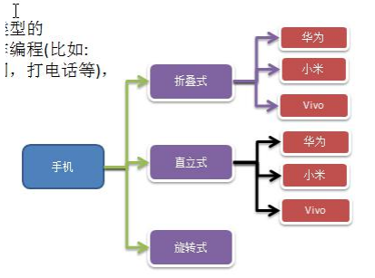
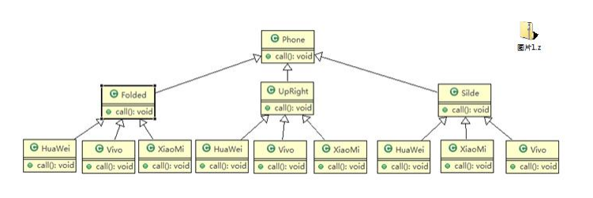
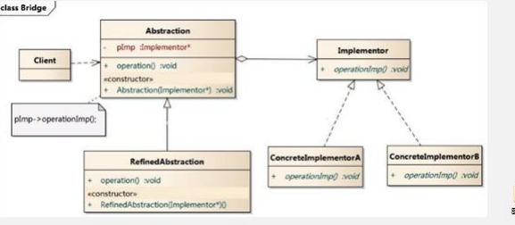

## 手机操作问题
现在对不同手机类型的不同品牌实现操作编程(比如:开机、关机、上网，打电话等)，如图

### 传统方案解决手机操作问题

### 传统方案解决手机操作问题分析

1) 扩展性问题(类爆炸)，如果我们再增加手机的样式(旋转式)，就需要增加各个品牌手机的类，同样如果我们增加
一个手机品牌，也要在各个手机样式类下增加。
2) 违反了单一职责原则，当我们增加手机样式时，要同时增加所有品牌的手机，这样增加了代码维护成本. 3) 解决方案-使用桥接模式

## 桥接模式(Bridge)-基本介绍
1) 桥接模式(Bridge 模式)是指：将实现与抽象放在两个不同的类层次中，使两个层次可以独立改变。
2) 是一种结构型设计模式
3) Bridge 模式基于类的最小设计原则，通过使用封装、聚合及继承等行为让不同的类承担不同的职责。它的主要
特点是把抽象(Abstraction)与行为实现(Implementation)分离开来，从而可以保持各部分的独立性以及应对他们的
功能扩展

1) Client 类：桥接模式的调用者
2) 抽象类(Abstraction) :维护了 Implementor / 即它的实现类 ConcreteImplementorA.., 二者是聚合关系, Abstraction
3) RefinedAbstraction : 是 Abstraction 抽象类的子类
4) Implementor : 行为实现类的接口
5) ConcreteImplementorA /B ：行为的具体实现类
6) 从 UML 图：这里的抽象类和接口是聚合的关系，其实调用和被调用关系