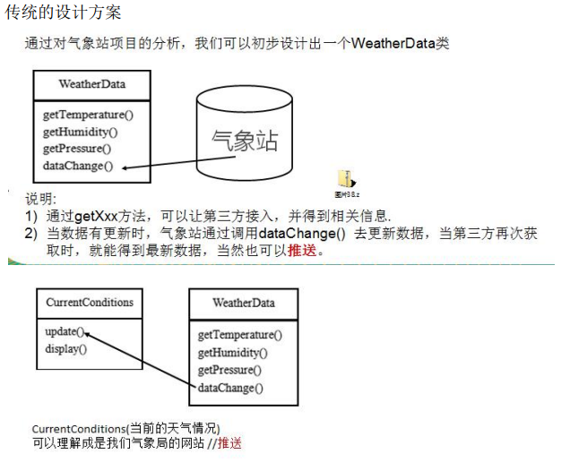
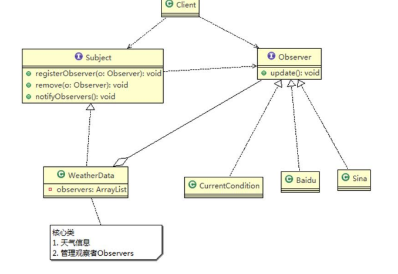

## 天气预报项目需求,具体要求如下：
1) 气象站可以将每天测量到的温度，湿度，气压等等以公告的形式发布出去(比如发布到自己的网站或第三方)。
2) 需要设计开放型 API，便于其他第三方也能接入气象站获取数据。
3) 提供温度、气压和湿度的接口
4) 测量数据更新时，要能实时的通知给第三方

## 天气预报设计方案 1-普通方案



````java
package com.atguigu.observer;

public class Client {
	public static void main(String[] args) {
		//创建接入方 currentConditions
		CurrentConditions currentConditions = new CurrentConditions();
		//创建 WeatherData 并将 接入方 currentConditions 传递到 WeatherData中
		WeatherData weatherData = new WeatherData(currentConditions);
		
		//更新天气情况
		weatherData.setData(30, 150, 40);
		
		//天气情况变化
		System.out.println("============天气情况变化=============");
		weatherData.setData(40, 160, 20);
		

	}
}

````
````java
package com.atguigu.observer;

/**
 * 显示当前天气情况（可以理解成是气象站自己的网站）
 * @author Administrator
 *
 */
public class CurrentConditions {
	// 温度，气压，湿度
	private float temperature;
	private float pressure;
	private float humidity;

	//更新 天气情况，是由 WeatherData 来调用，我使用推送模式
	public void update(float temperature, float pressure, float humidity) {
		this.temperature = temperature;
		this.pressure = pressure;
		this.humidity = humidity;
		display();
	}

	//显示
	public void display() {
		System.out.println("***Today mTemperature: " + temperature + "***");
		System.out.println("***Today mPressure: " + pressure + "***");
		System.out.println("***Today mHumidity: " + humidity + "***");
	}
}

````
````java
package com.atguigu.observer;

/**
 * 类是核心
 * 1. 包含最新的天气情况信息 
 * 2. 含有 CurrentConditions 对象
 * 3. 当数据有更新时，就主动的调用   CurrentConditions对象update方法(含 display), 这样他们（接入方）就看到最新的信息
 * @author Administrator
 *
 */
public class WeatherData {
	private float temperatrue;
	private float pressure;
	private float humidity;
	private CurrentConditions currentConditions;
	//加入新的第三方

	public WeatherData(CurrentConditions currentConditions) {
		this.currentConditions = currentConditions;
	}

	public float getTemperature() {
		return temperatrue;
	}

	public float getPressure() {
		return pressure;
	}

	public float getHumidity() {
		return humidity;
	}

	public void dataChange() {
		//调用 接入方的 update
		currentConditions.update(getTemperature(), getPressure(), getHumidity());
	}

	//当数据有更新时，就调用 setData
	public void setData(float temperature, float pressure, float humidity) {
		this.temperatrue = temperature;
		this.pressure = pressure;
		this.humidity = humidity;
		//调用dataChange， 将最新的信息 推送给 接入方 currentConditions
		dataChange();
	}
}

````

## 传统方式的问题分析
2) 无法在运行时动态的添加第三方 (新浪网站)
3) 违反 ocp 原则=>观察者模式

## 观察者模式原理

1) 观察者模式类似订牛奶业务
2) 奶站/气象局：Subject
3) 用户/第三方网站：Observer

* Subject：登记注册、移除和通知
  1) registerObserver 注册
  2) removeObserver 移除
  3) notifyObservers() 通知所有的注册的用户，根据不同需求，可以是更新数据，让用户来取，也可能是实施推送，看具体需求定

* Observer：接收输入

* 观察者模式：对象之间多对一依赖的一种设计方案，被依赖的对象为 Subject，依赖的对象为 Observer，Subject通知 Observer 变化,比如这里的奶站是 Subject，是 1 的一方。用户时 Observer，是多的一方。

### 观察者模式解决天气预报需求


````java
package com.atguigu.observer.improve;

public class BaiduSite implements Observer {

	// 温度，气压，湿度
	private float temperature;
	private float pressure;
	private float humidity;

	// 更新 天气情况，是由 WeatherData 来调用，我使用推送模式
	public void update(float temperature, float pressure, float humidity) {
		this.temperature = temperature;
		this.pressure = pressure;
		this.humidity = humidity;
		display();
	}

	// 显示
	public void display() {
		System.out.println("===百度网站====");
		System.out.println("***百度网站 气温 : " + temperature + "***");
		System.out.println("***百度网站 气压: " + pressure + "***");
		System.out.println("***百度网站 湿度: " + humidity + "***");
	}

}

````
````java
package com.atguigu.observer.improve;

public class Client {

	public static void main(String[] args) {
		// TODO Auto-generated method stub
		//创建一个WeatherData
		WeatherData weatherData = new WeatherData();
		
		//创建观察者
		CurrentConditions currentConditions = new CurrentConditions();
		BaiduSite baiduSite = new BaiduSite();
		
		//注册到weatherData
		weatherData.registerObserver(currentConditions);
		weatherData.registerObserver(baiduSite);
		
		//测试
		System.out.println("通知各个注册的观察者, 看看信息");
		weatherData.setData(10f, 100f, 30.3f);
		
		
		weatherData.removeObserver(currentConditions);
		//测试
		System.out.println();
		System.out.println("通知各个注册的观察者, 看看信息");
		weatherData.setData(10f, 100f, 30.3f);
	}

}

````
````java
package com.atguigu.observer.improve;

public class CurrentConditions implements Observer {

	// 温度，气压，湿度
	private float temperature;
	private float pressure;
	private float humidity;

	// 更新 天气情况，是由 WeatherData 来调用，我使用推送模式
	public void update(float temperature, float pressure, float humidity) {
		this.temperature = temperature;
		this.pressure = pressure;
		this.humidity = humidity;
		display();
	}

	// 显示
	public void display() {
		System.out.println("***Today mTemperature: " + temperature + "***");
		System.out.println("***Today mPressure: " + pressure + "***");
		System.out.println("***Today mHumidity: " + humidity + "***");
	}
}

````
````java
package com.atguigu.observer.improve;

//观察者接口，有观察者来实现
public interface Observer {

	public void update(float temperature, float pressure, float humidity);
}

````
````java
package com.atguigu.observer.improve;

//接口, 让WeatherData 来实现 
public interface Subject {
	
	public void registerObserver(Observer o);
	public void removeObserver(Observer o);
	public void notifyObservers();
}

````
````java
package com.atguigu.observer.improve;

import java.util.ArrayList;

/**
 * 类是核心
 * 1. 包含最新的天气情况信息 
 * 2. 含有 观察者集合，使用ArrayList管理
 * 3. 当数据有更新时，就主动的调用   ArrayList, 通知所有的（接入方）就看到最新的信息
 * @author Administrator
 *
 */
public class WeatherData implements Subject {
	private float temperatrue;
	private float pressure;
	private float humidity;
	//观察者集合
	private ArrayList<Observer> observers;
	
	//加入新的第三方

	public WeatherData() {
		observers = new ArrayList<Observer>();
	}

	public float getTemperature() {
		return temperatrue;
	}

	public float getPressure() {
		return pressure;
	}

	public float getHumidity() {
		return humidity;
	}

	public void dataChange() {
		//调用 接入方的 update
		
		notifyObservers();
	}

	//当数据有更新时，就调用 setData
	public void setData(float temperature, float pressure, float humidity) {
		this.temperatrue = temperature;
		this.pressure = pressure;
		this.humidity = humidity;
		//调用dataChange， 将最新的信息 推送给 接入方 currentConditions
		dataChange();
	}

	//注册一个观察者
	@Override
	public void registerObserver(Observer o) {
		// TODO Auto-generated method stub
		observers.add(o);
	}

	//移除一个观察者
	@Override
	public void removeObserver(Observer o) {
		// TODO Auto-generated method stub
		if(observers.contains(o)) {
			observers.remove(o);
		}
	}

	//遍历所有的观察者，并通知
	@Override
	public void notifyObservers() {
		// TODO Auto-generated method stub
		for(int i = 0; i < observers.size(); i++) {
			observers.get(i).update(this.temperatrue, this.pressure, this.humidity);
		}
	}
}

````

### 观察者模式的好处
1) 观察者模式设计后，会以集合的方式来管理用户(Observer)，包括注册，移除和通知。
2) 这样，我们增加观察者(这里可以理解成一个新的公告板)，就不需要去修改核心类 WeatherData 不会修改代码，遵守了 ocp 原则。