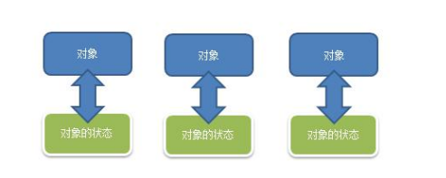
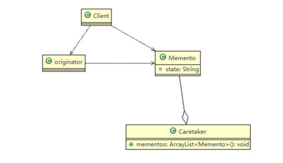

## 游戏角色状态恢复问题
游戏角色有攻击力和防御力，在大战 Boss 前保存自身的状态(攻击力和防御力)，当大战 Boss 后攻击力和防御力下降，从备忘录对象恢复到大战前的状态

### 传统方案解决游戏角色恢复



1) 一个对象，就对应一个保存对象状态的对象， 这样当我们游戏的对象很多时，不利于管理，开销也很大. 2) 传统的方式是简单地做备份，new 出另外一个对象出来，再把需要备份的数据放到这个新对象，但这就暴露了对象内部的细节
3) 解决方案： => 备忘录模式

## 备忘录模式基本介绍
1) 备忘录模式（Memento Pattern）在不破坏封装性的前提下，捕获一个对象的内部状态，并在该对象之外保存这个状态。这样以后就可将该对象恢复到原先保存的状态
2) 可以这里理解备忘录模式：现实生活中的备忘录是用来记录某些要去做的事情，或者是记录已经达成的共同意
见的事情，以防忘记了。而在软件层面，备忘录模式有着相同的含义，备忘录对象主要用来记录一个对象的某
种状态，或者某些数据，当要做回退时，可以从备忘录对象里获取原来的数据进行恢复操作
3) 备忘录模式属于行为型模式

## 备忘录模式的原理类图

1) originator : 对象(需要保存状态的对象)
2) Memento ： 备忘录对象,负责保存好记录，即 Originator 内部状态
3) Caretaker: 守护者对象,负责保存多个备忘录对象， 使用集合管理，提高效率
4) 说明：如果希望保存多个 originator 对象的不同时间的状态，也可以，只需要要 HashMap <String, 集合>

## 代码实现
````java
package com.atguigu.memento.theory;

import java.util.ArrayList;
import java.util.List;

public class Caretaker {
	
	//在List 集合中会有很多的备忘录对象
	private List<Memento> mementoList = new ArrayList<Memento>();
	
	public void add(Memento memento) {
		mementoList.add(memento);
	}
	
	//获取到第index个Originator 的 备忘录对象(即保存状态)
	public Memento get(int index) {
		return mementoList.get(index);
	}
}

````
````java
package com.atguigu.memento.theory;

import java.util.ArrayList;
import java.util.HashMap;

public class Client {

	public static void main(String[] args) {
		// TODO Auto-generated method stub
		
		Originator originator = new Originator();
		Caretaker caretaker = new Caretaker();
		
		originator.setState(" 状态#1 攻击力 100 ");
		
		//保存了当前的状态
		caretaker.add(originator.saveStateMemento());
		
		originator.setState(" 状态#2 攻击力 80 ");
		
		caretaker.add(originator.saveStateMemento());
		
		originator.setState(" 状态#3 攻击力 50 ");
		caretaker.add(originator.saveStateMemento());
		
		
		
		System.out.println("当前的状态是 =" + originator.getState());
		
		//希望得到状态 1, 将 originator 恢复到状态1
		
		originator.getStateFromMemento(caretaker.get(0));
		System.out.println("恢复到状态1 , 当前的状态是");
		System.out.println("当前的状态是 =" + originator.getState());
		
		
		
	}

}

````
````java
````
````java
````