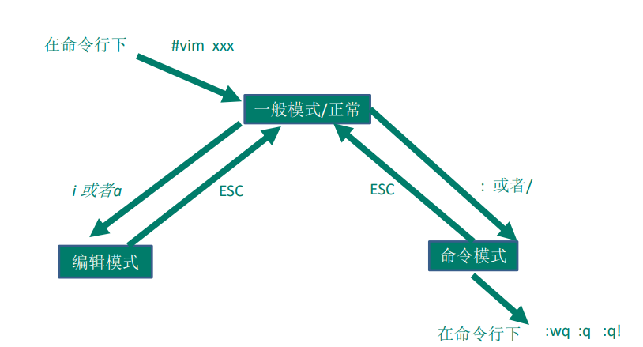
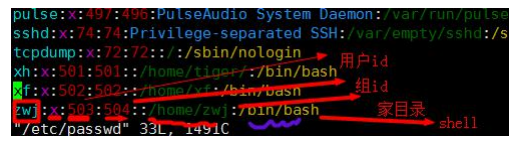
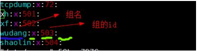
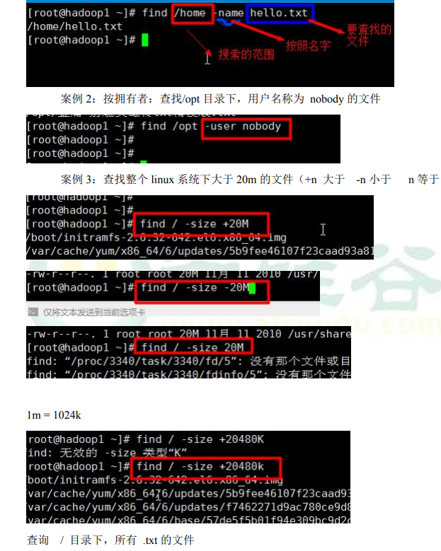
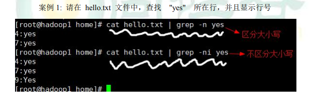

## vi和vim
所有的 Linux 系统都会内建 vi 文本编辑器。
Vim 具有程序编辑的能力，可以看做是Vi的增强版本，可以主动的以字体颜色辨别
语法的正确性，方便程序设计。代码补完、编译及错误跳转等方便编程的功能特别
丰富，在程序员中被广泛使用。

vi和vim常用的三种模式

正常模式:
      
      以 vim 打开一个档案就直接进入一般模式了(这是默认的模式)。在这个模式中， 你可以使用『上下左右』按键来移动光标，你可以使用『删除字符』或『删除整行』来处理档案内容，也可以使用『复制、贴上』来处理你的文件数据。

插入模式:

    按下i, I, o, O, a, A, r, R等任何一个字母之后才会进入编辑模式, 一般来说按i即可.
命令行模式

    在这个模式当中， 可以提供你相关指令，完成读取、存盘、替换、离开 vim 、显示行号等的动作则是在此模式中达成的！

    

## 关机&重启命令

|命令 | 描述 |
---- |-----------
shutdown –h now | 立该进行关机
shudown -h 1 | "hello, 1 分钟后会关机了"
shutdown –r now | 现在重新启动计算机
halt | 关机，作用和上面一样.
reboot  | 现在重新启动计算机
sync  | 把内存的数据同步到磁盘.

## 用户登录和注销
1) 登录时尽量少用root帐号登录，因为它是系统管理员，最大的权限，避免操作失误。可以利用普通用户登录，登录后再用”su - 用户名’命令来切换成系统管理员身份.
2) 在提示符下输入 logout 即可注销用户

## 用户管理

* 添加用户:

       useradd 用户名
1) 当创建用户成功后，会自动的创建和用户同名的家目录
2) 也可以通过 useradd -d 指定目录 新的用户名，给新创建的用户指定家目录

* 指定/修改密码

      passwd 用户名
* 删除用户

      userdel 用户名
* 查询用户信息指令

      id 用户名
* 切换用户

在操作Linux中，如果当前用户的权限不够，可以通过 su - 指令，切换到高权限用户，比如root

      su – 切换用户名
1) 从权限高的用户切换到权限低的用户，不需要输入密码，反之需要。
2) 当需要返回到原来用户时，使用exit指令

* 查看当前用户/登录用户
     
      whoami/ who am I

* 用户组

类似于角色，系统可以对有共性的多个用户进行统一的管理。

    新增组
      groupadd 组名

    删除组
      groupdel 组名

    增加用户时直接加上组
      useradd –g 用户组 用户名

    修改用户的组
      usermod –g 用户组 用户名

### 用户和组的相关文件
1) /etc/passwd 文件

   用户（user）的配置文件，记录用户的各种信息
每行的含义：用户名:口令:用户标识号:组标识号:注释性描述:主目录:登录Shell

    
2) /etc/shadow 文件

   口令的配置文件
每行的含义：登录名:加密口令:最后一次修改时间:最小时间间隔:最大时间间隔:警
告时间:不活动时间:失效时间:标志

3) /etc/group 文件

   组(group)的配置文件，记录Linux包含的组的信息
每行含义：组名:口令:组标识号:组内用户列表

   

## 实用指令

### 指定运行级别
   

常用运行级别是3和5 ，要修改默认的运行级别可改文件

/etc/inittab的id:5:initdefault:这一行中的数字

命令：init [012356]

### 帮助指令

1) man 获得帮助信息
  
       man [命令或配置文件]（功能描述：获得帮助信息）

2) help指令

       help 命令 （功能描述：获得shell内置命令的帮助信息）

### 文件目录类
1) pwd 指令

       pwd (功能描述：显示当前工作目录的绝对路径)

2) ls指令

       ls [选项] [目录或是文件]
       常用选项
       -a ：显示当前目录所有的文件和目录，包括隐藏的。
       -l ：以列表的方式显示信息

3) cd 指令

       基本语法
        cd [参数] (功能描述：切换到指定目录)

       常用参数
       绝对路径和相对路径
        cd ~ 或者cd ：回到自己的家目录
        cd .. 回到当前目录的上一级目录
4) mkdir指令

        mkdir指令用于创建目录

       基本语法
         mkdir [选项] 要创建的目录

       常用选项
         -p ：创建多级目录

       应用实例
        案例1:创建一个目录 /home/dog
        案例2:创建多级目录 /home/animal/tiger 

5) rmdir指令

        rmdir指令删除空目录

        基本语法
        rmdir [选项] 要删除的空目录

        应用实例
        案例1:删除一个目录 /home/dog

        使用细节

        rmdir 删除的是空目录，如果目录下有内容时无法删除的。
        提示：如果需要删除非空目录，需要使用 rm -rf 要删除的目录

6) touch指令

        touch指令创建空文件

        基本语法
        touch 文件名称

7) cp指令
 
       cp 指令拷贝文件到指定目录

       基本语法
       cp [选项] source dest

       常用选项
       -r ：递归复制整个文件夹

8)  rm指令

        rm 指令移除文件或目录
       
        基本语法
        rm [选项] 要删除的文件或目录

        常用选项
        -r ：递归删除整个文件夹
        -f ： 强制删除不提示

9) mv指令

       mv 移动文件与目录或重命名

       基本语法
       mv oldNameFile newNameFile (功能描述：重命名)
       mv /temp/movefile /targetFolder (功能描述：移动文件)

10) cat指令
 
        cat 查看文件内容

        基本语法
        cat [选项] 要查看的文件

        常用选项
        -n ：显示行号

        使用细节
        cat 只能浏览文件，而不能修改文件，为了浏览方便，一般会带上 管道命令 | more

11) more指令
 
 more指令是一个基于VI编辑器的文本过滤器，它以全屏幕的方式按页显示文本文件的内容。more指令中内置了若干快捷键，详见操作说明

      基本语法

        more 要查看的文件

| 操作 | 功能说明 |
|-------|-----------|
空白键 (space) | 代表向下翻一页
Enter | 代表向下翻『一行』
q  | 代表立刻离开 more ，不再显示该文件内容
Ctrl+F | 向下滚动一屏
Ctrl+B | 返回上一屏
=   | 输出当前行的行号
:f  | 输出文件名和当前行的行号

12) less指令

less指令用来分屏查看文件内容，它的功能与more指令类似，但是比more指令更加强大，支
持各种显示终端。less指令在显示文件内容时，并不是一次将整个文件加载之后才显示，而是
根据显示需要加载内容，对于显示大型文件具有较高的效率。

     基本语法

       less 要查看的文件

| 操作 | 功能说明|
|-------|----------|
空白键  | 向下翻动一页
[pagedown] | 向下翻动一页
[pageup] | 向上翻动一页
/字串  | 向下搜寻『字串』的功能；n：向下查找；N：向上查找
?字串  |向上搜寻『字串』的功能；n：向上查找；N：向下查找
q    | 离开 less 这个程序

13) echo指令

echo输出内容到控制台。

        基本语法
        echo [选项] [输出内容]

14) head指令

head用于显示文件的开头部分内容，默认情况下head指令显示文件的前10行内容

         head 文件 (功能描述：查看文件头10行内容)
         head -n 5 文件 (功能描述：查看文件头5行内容，5可以是任意行数

15) tail指令

tail用于输出文件中尾部的内容，默认情况下tail指令显示文件的前10行内容。

         基本语法
         1 tail 文件 （功能描述：查看文件头10行内容）
         2 tail -n 5 文件 （功能描述：查看文件头5行内容，5可以是任意行数）
         3 tail -f 文件 （功能描述：实时追踪该文档的所有更新）

16) 指令 >  和 >> 指令

\> 输出重定向和 >> 追加

      基本语法

        ls -l >文件 （功能描述：列表的内容写入文件a.txt中（覆盖写））

        ls -al >>文件 （功能描述：列表的内容追加到文件aa.txt的末尾）

        cat 文件1 > 文件2 （功能描述：将文件1的内容覆盖到文件2）

        echo "内容">> 文件

17) ln 指令

  软链接也成为符号链接，类似于windows里的快捷方式，主要存放了链接其他文件的路径

      基本语法
      ln -s [原文件或目录] [软链接名] （功能描述：给原文件创建一个软链接）

### 时间日期类

1) history指令

查看已经执行过历史命令,也可以执行历史指令

        基本语法
        history （功能描述：查看已经执行过历史命令）

2) date指令-显示当前日期

        基本语法
        date （功能描述：显示当前时间）
        date +%Y （功能描述：显示当前年份）
        date +%m （功能描述：显示当前月份）
        date +%d （功能描述：显示当前是哪一天）
        date "+%Y-%m-%d %H:%M:%S"（功能描述：显示年月日时分秒）

3) date指令-设置日期

        基本语法
        date -s 字符串时间

4) cal指令

     查看日历指令

         基本语法
         cal [选项] （功能描述：不加选项，显示本月日历）

### 搜索查找类
1) find指令

    find指令将从指定目录向下递归地遍历其各个子目录，将满足条件的文件或者目录显示在终
端。

       基本语法
       find [搜索范围] [选项]

|选项 | 功能 |
|------|-------|
|-name | <查询方式> 按照指定的文件名查找模式查找文件|
|-user  | <用户名> 查找属于指定用户名所有文件 |
|-size  |<文件大小> 按照指定的文件大小查找文件 |

   

2) locate指令

locaate指令可以快速定位文件路径。locate指令利用事先建立的系统中所有文件名称及路径
的locate数据库实现快速定位给定的文件。Locate指令无需遍历整个文件系统，查询速度较快。
为了保证查询结果的准确度，管理员必须定期更新locate时刻。

     基本语法
        locate 搜索文件

     特别说明
        由于locate指令基于数据库进行查询，所以第一次运行前，必须使用updatedb指令创建locate
     数据库。

3) grep指令和 管道符号 | 

    grep 过滤查找 ， 管道符，“|”，表示将前一个命令的处理结果输出传递给后面的命令处理。

        grep [选项] 查找内容 源文件

  |选项 | 功能|
  |------|------|
|-n | 显示匹配行及行号。|
|-i  | 忽略字母大小写|

   

### 压缩和解压类

1) gzip/gunzip 指令

gzip 用于压缩文件， gunzip 用于解压的

       基本语法
       gzip 文件 （功能描述：压缩文件，只能将文件压缩为*.gz文件）
       gunzip 文件.gz （功能描述：解压缩文件命令）

2) zip/unzip 指令

zip 用于压缩文件， unzip 用于解压的，这个在项目打包发布中很有用的

       基本语法
       zip [选项] XXX.zip 将要压缩的内容（功能描述：压缩文件和目录的命令）
       unzip [选项] XXX.zip （功能描述：解压缩文件）

       zip常用选项
         -r：递归压缩，即压缩目录
       unzip的常用选项
        -d<目录> ：指定解压后文件的存放目录

3) tar 指令

tar 指令 是打包指令，最后打包后的文件是 .tar.gz 的文件。

      基本语法
      tar [选项] XXX.tar.gz 打包的内容 (功能描述：打包目录，压缩后的文件格式.tar.gz) 

|选项 | 功能|
|------|------|
|-c | 产生.tar打包文件 |
|-v | 显示详细信息 |
|-f | 指定压缩后的文件名 |
|-z | 打包同时压缩 |
|-x | 解包.tar文件 |