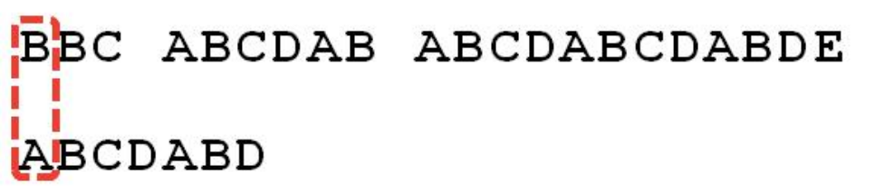
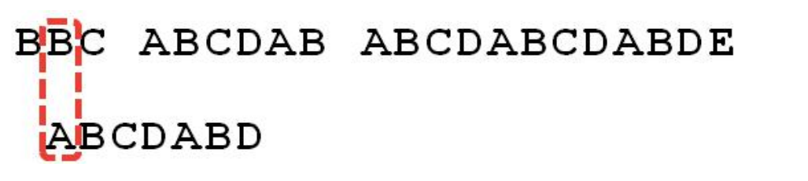
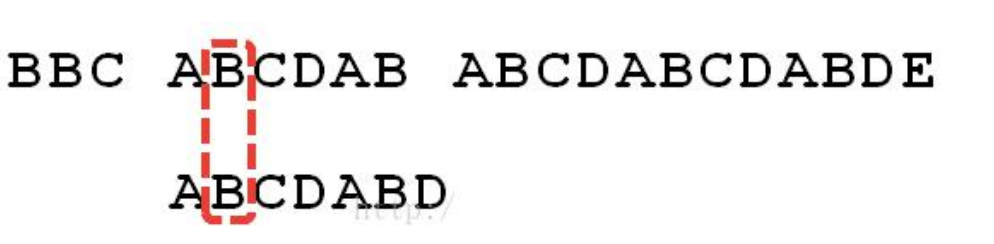
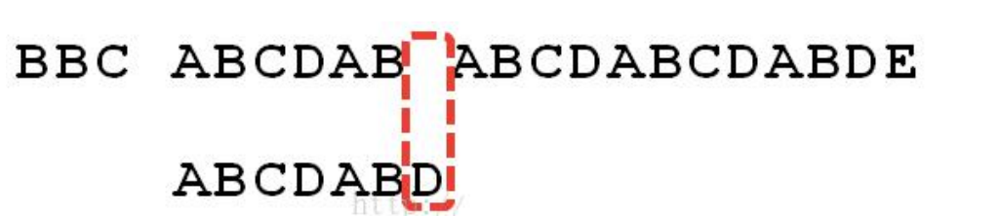
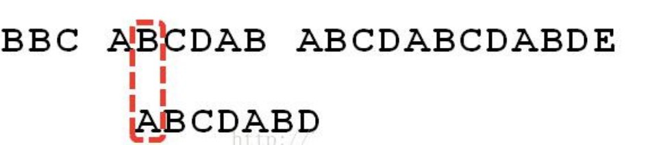

## 应用场景-字符串匹配问题

字符串匹配问题：
1) 有一个字符串 str1= ""硅硅谷 尚硅谷你尚硅 尚硅谷你尚硅谷你尚硅你好""，和一个子串 str2="尚硅谷你尚硅你"
2) 现在要判断 str1 是否含有 str2, 如果存在，就返回第一次出现的位置, 如果没有，则返回-1

## 暴力匹配算法
如果用暴力匹配的思路，并假设现在str1匹配到 i 位置，子串str2匹配到 j 位置，则有:

1) 如果当前字符匹配成功（即str1[i] == str2[j]），则i++，j++，继续匹配下一个字符
2) 如果失配（即str1[i]! = str2[j]），令i = i - (j - 1)，j = 0。相当于每次匹配失败时，i 回溯，j 被置为0。
3) 用暴力方法解决的话就会有大量的回溯，每次只移动一位，若是不匹配，移动到下一位接着判断，浪费了大量的时间。(不可行!)
4) 暴力匹配算法实现.

````java
package com.atguigu.kmp;

public class ViolenceMatch {

	public static void main(String[] args) {
		// TODO Auto-generated method stub
		//测试暴力匹配算法
		String str1 = "硅硅谷 尚硅谷你尚硅 尚硅谷你尚硅谷你尚硅你好";
		String str2 = "尚硅谷你尚硅你~";
		int index = violenceMatch(str1, str2);
		System.out.println("index=" + index);

	}

	// 暴力匹配算法实现
	public static int violenceMatch(String str1, String str2) {
		char[] s1 = str1.toCharArray();
		char[] s2 = str2.toCharArray();

		int s1Len = s1.length;
		int s2Len = s2.length;

		int i = 0; // i索引指向s1
		int j = 0; // j索引指向s2
		while (i < s1Len && j < s2Len) {// 保证匹配时，不越界

			if(s1[i] == s2[j]) {//匹配ok
				i++;
				j++;
			} else { //没有匹配成功
				//如果失配（即str1[i]! = str2[j]），令i = i - (j - 1)，j = 0。
				i = i - (j - 1);
				j = 0;
			}
		}
		
		//判断是否匹配成功
		if(j == s2Len) {
			return i - j;
		} else {
			return -1;
		}
	}

}
````
## KMP 算法介绍
1) KMP 是一个解决模式串在文本串是否出现过，如果出现过，最早出现的位置的经典算法 
2) Knuth-Morris-Pratt 字符串查找算法，简称为 “KMP 算法”，常用于在一个文本串 S 内查找一个模式串 P 的 出现位置，这个算法由 Donald Knuth、Vaughan Pratt、James H. Morris 三人于 1977 年联合发表，故取这 3 人的 姓氏命名此算法. 
3) KMP 方法算法就利用之前判断过信息，通过一个 next 数组，保存模式串中前后最长公共子序列的长度，每次 回溯时，通过 next 数组找到，前面匹配过的位置，省去了大量的计算时间 
4) 参考资料：https://www.cnblogs.com/ZuoAndFutureGirl/p/9028287.html

## KMP 算法最佳应用-字符串匹配问题
1) 有一个字符串 str1= "BBC ABCDAB ABCDABCDABDE"，和一个子串 str2="ABCDABD" 
2) 现在要判断 str1 是否含有 str2, 如果存在，就返回第一次出现的位置, 如果没有，则返回-1 
3) 要求：使用 KMP 算法完成判断，不能使用简单的暴力匹配算法.

## 思路分析图解
1) 举例来说，有一个字符串 Str1 = “BBC ABCDAB ABCDABCDABDE”，判断，里面是否包含另一个字符串 Str2 = “ABCDABD”？ 1.首先，用 Str1 的第一个字符和 Str2 的第一个字符去比较，不符合，关键词向
后移动一位

    
2) . 重复第一步，还是不符合，再后移

   

3)  一直重复，直到 Str1 有一个字符与 Str2 的第一个字符符合为止

    

4) 接着比较字符串和搜索词的下一个字符，还是符合。

    

5) 遇到 Str1 有一个字符与 Str2 对应的字符不符合。

    

6) 这时候，想到的是继续遍历 Str1 的下一个字符，重复第 1 步。(其实是很不明智的，因为此时 BCD 已经比较过了， 没有必要再做重复的工作，一个基本事实是，当空格与 D 不匹配时，你其实知道前面六个字符是”ABCDAB”。 KMP 算法的想法是，设法利用这个已知信息，不要把”搜索位置”移回已经比较过的位置，继续把它向后移，这 样就提高了效率。)

     

7) 怎么做到把刚刚重复的步骤省略掉？可以对 Str2 计算出一张《部分匹配表》，这张表的产生在后面介绍

    

8) 已知空格与 D 不匹配时，前面六个字符”ABCDAB”是匹配的。查表可知，最后一个匹配字符 B 对应的”部分 匹配值”为 2，因此按照下面的公式算出向后移动的位数： 移动位数 = 已匹配的字符数 - 对应的部分匹配值 因为 6 - 2 等于 4，所以将搜索词向后移动 4 位。

9) 因为空格与Ｃ不匹配，搜索词还要继续往后移。这时，已匹配的字符数为 2（”AB”），对应的”部分匹配值” 为 0。所以，移动位数 = 2 - 0，结果为 2，于是将搜索词向后移 2 位。

## 代码示例

````java
package com.atguigu.kmp;

import java.util.Arrays;

public class KMPAlgorithm {

	public static void main(String[] args) {
		// TODO Auto-generated method stub
		String str1 = "BBC ABCDAB ABCDABCDABDE";
		String str2 = "ABCDABD";
		//String str2 = "BBC";
		
		int[] next = kmpNext("ABCDABD"); //[0, 1, 2, 0]
		System.out.println("next=" + Arrays.toString(next));
		
		int index = kmpSearch(str1, str2, next);
		System.out.println("index=" + index); // 15了
		
		
	}
	
	//写出我们的kmp搜索算法
	/**
	 * 
	 * @param str1 源字符串
	 * @param str2 子串
	 * @param next 部分匹配表, 是子串对应的部分匹配表
	 * @return 如果是-1就是没有匹配到，否则返回第一个匹配的位置
	 */
	public static int kmpSearch(String str1, String str2, int[] next) {
		
		//遍历 
		for(int i = 0, j = 0; i < str1.length(); i++) {
			
			//需要处理 str1.charAt(i) ！= str2.charAt(j), 去调整j的大小
			//KMP算法核心点, 可以验证...
			while( j > 0 && str1.charAt(i) != str2.charAt(j)) {
				j = next[j-1]; 
			}
			
			if(str1.charAt(i) == str2.charAt(j)) {
				j++;
			}			
			if(j == str2.length()) {//找到了 // j = 3 i 
				return i - j + 1;
			}
		}
		return  -1;
	}

	//获取到一个字符串(子串) 的部分匹配值表
	public static  int[] kmpNext(String dest) {
		//创建一个next 数组保存部分匹配值
		int[] next = new int[dest.length()];
		next[0] = 0; //如果字符串是长度为1 部分匹配值就是0
		for(int i = 1, j = 0; i < dest.length(); i++) {
			//当dest.charAt(i) != dest.charAt(j) ，我们需要从next[j-1]获取新的j
			//直到我们发现 有  dest.charAt(i) == dest.charAt(j)成立才退出
			//这时kmp算法的核心点
			while(j > 0 && dest.charAt(i) != dest.charAt(j)) {
				j = next[j-1];
			}
			
			//当dest.charAt(i) == dest.charAt(j) 满足时，部分匹配值就是+1
			if(dest.charAt(i) == dest.charAt(j)) {
				j++;
			}
			next[i] = j;
		}
		return next;
	}
}

````