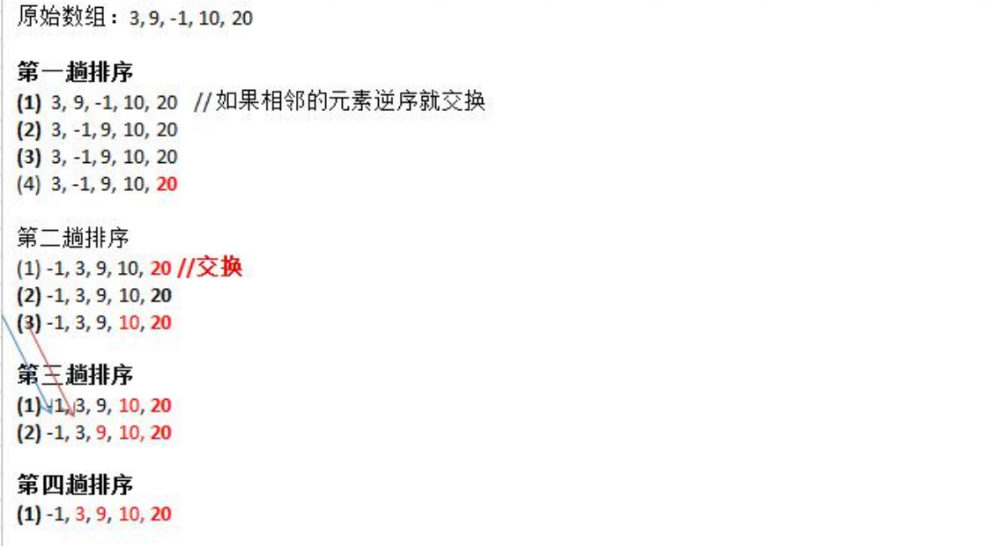
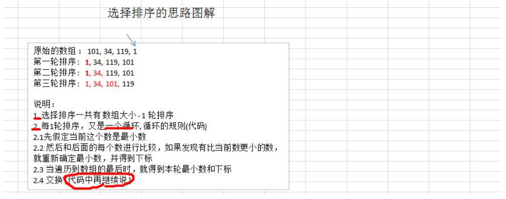

## 排序算法

排序也称排序算法(Sort Algorithm)，排序是将一组数据，依指定的顺序进行排列的过

### 排序的分类：
排序的分类：
1) 内部排序:
指将需要处理的所有数据都加载到内部存储器中进行排序。
2) 外部排序法：
数据量过大，无法全部加载到内存中，需要借助外部存储进行排序。

  

### 冒泡排序

冒泡排序（Bubble Sorting）的基本思想是：通过对待排序序列从前向后（从下标较小的元素开始）,依次比较 相邻元素的值，若发现逆序则交换，使值较大的元素逐渐从前移向后部，就象水底下的气泡一样逐渐向上冒

因为排序的过程中，各元素不断接近自己的位置，如果一趟比较下
来没有进行过交换，就说明序列有序，因此要在排序过程中设置
一个标志flag判断元素是否进行过交换。从而减少不必要的比较。

  

1) 一共进行 数组的大小-1 次 大的循环
2) 每一趟排序的次数在逐渐的减少
3) 如果我们发现在某趟排序中，没有发生一次交换， 可以提前结束冒泡排序。

#### 代码示例

````java
    public  static  void  bubbleSort(int[] arr){
        boolean flag = false;
        for (int i = 0; i < arr.length - 1;i ++){
            for (int j = 0; j < arr.length- 1 - i; j++) {
                if(arr[j] > arr[j+1]){
                    int temp = arr[j];
                    arr[j] = arr[j+1];
                    arr[j+1]= temp;
                    flag = true;
                }
            }
            if(flag){
               flag = false;
            }else {
                break;
            }
        }
    }
````

### 选择排序
选择排序（select sorting）也是一种简单的排序方法。它的基本思想是：第一次从 arr[0]~arr[n-1]中选取最小值， 与 arr[0]交换，第二次从 arr[1]~arr[n-1]中选取最小值，与 arr[1]交换，第三次从 arr[2]~arr[n-1]中选取最小值，与 arr[2] 交换，…，第 i 次从 arr[i-1]~arr[n-1]中选取最小值，与 arr[i-1]交换，…, 第 n-1 次从 arr[n-2]~arr[n-1]中选取最小值， 与 arr[n-2]交换，总共通过 n-1 次，得到一个按排序码从小到大排列的有序序列。

 

* 选择排序思路分析图

 

#### 代码示例
````java
    public static  void  selectSort(int[] arr){
        for (int i = 0; i < arr.length - 1; i++) {
            int temp = arr[i];
            int index = i;
            for (int j = i; j < arr.length - 1; j++) {
                if(temp > arr[j+1]){
                    temp = arr[j + 1];
                    index = j+1;
                }
            }
            if (index != i) {
              arr[index] = arr[i];
              arr[i] = temp;
            }
        }
    }
````
### 插入排序
插入排序（Insertion Sorting）的基本思想是：把n个待排序的元素看成为一个有序表和一个无序表，开始时有序表中只包含一个元素，无序表中包含有n-1个元素，排序过程中每次从无序表中取出第一个元素，把它的排序码依次与有序表元素的排序码进行比较，将它插入到有序表中的适当位置，使之成为新的有序表。

 

#### 代码示例

````java
    public static void insertSort(int[] arr) {
        int insertValue = 0;
        int insertIndex = 0;
        for (int i = 1; i < arr.length; i++){
            insertIndex = i - 1;
            insertValue = arr[i];
            while (insertIndex >= 0 && insertValue < arr[insertIndex]){
                arr[insertIndex + 1] = arr[insertIndex];
                insertIndex --;
            }
            if(insertIndex + 1 != i) {
                arr[insertIndex + 1] = insertValue;
            }
        }
    }
````

### 希尔排序
希尔排序是希尔（Donald Shell）于1959年提出的一种排序算法。希尔排序也是一种插入排序，它是简单插入排序经过改进之后的一个更高效的版本，也称为缩小增量排序

希尔排序是把记录按下标的一定增量分组，对每组使用直接插入排序算法排序；随着增量逐渐减少，每组包含的关键词越来越多，当增量减至1时，整个文件恰被分成一组，算法便终止

 

#### 代码示例
````java
    public static void shellSortMove(int[] arr) {

        for (int gap = arr.length / 2; gap > 0; gap /= 2) {
            for (int i = gap; i < arr.length; i++) {
                int j = i;
                int temp = arr[j];
                while (j - gap >= 0 && temp < arr[j - gap]){
                    arr[j] = arr[j-gap];
                    j -= gap;
                }
                arr[j] = temp;
            }
        }

    }
````

### 快速排序
快速排序（Quicksort）是对冒泡排序的一种改进。基本思想是：通过一趟排序将要排序的数据分割成独立的两部分，其中一部分的所有数据都比另外一部分的所有数据都要小，然后再按此方法对这两部分数据分别进行快速排序，整个排序过程可以递归进行，以此达到整个数据变成有序序列

快速排序流程：
1) 从数列中挑出一个基准值。
2) 将所有比基准值小的摆放在基准前面，所有比基准值大的摆在基准的后面(相同的数可以到任一边)；在这个分区退出之后，该基准就处于数列的中间位置。
3) 递归地把"基准值前面的子数列"和"基准值后面的子数列"进行排序。

 

#### 代码示例
````java

````
