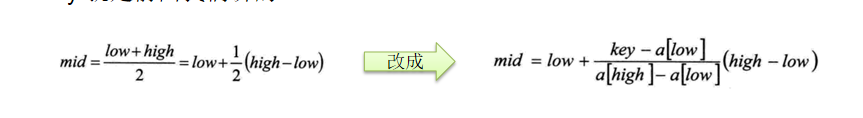

查找算法
====

## 线性查找算法
  有一个数列： {1,8, 10, 89, 1000, 1234} ，判断数列中是否包含此名称【顺序查找】 要求: 如果找到了，就提示找到，并给出下标值。

### 代码示例
````java
public static void main(String[] args) {
		int arr[] = { 1, 9, 11, -1, 34, 89 };// 没有顺序的数组
		int index = seqSearch(arr, -11);
		if(index == -1) {
			System.out.println("没有找到到");
		} else {
			System.out.println("找到，下标为=" + index);
		}
	}

	/**
	 * 这里我们实现的线性查找是找到一个满足条件的值，就返回
	 * @param arr
	 * @param value
	 * @return
	 */
	public static int seqSearch(int[] arr, int value) {
		// 线性查找是逐一比对，发现有相同值，就返回下标
		for (int i = 0; i < arr.length; i++) {
			if(arr[i] == value) {
				return i;
			}
		}
		return -1;
	}
````

## 二分查找算法
二分查找又叫折半查找。它对要查找的序列有两个要求，一是该序列必须是有序的（即该序列中的所有元素都是按照大小关系排好序的，升序和降序都可以），二是该序列必须是顺序存储的。

### 算法原理

1. 如果待查序列为空，那么就返回-1，并退出算法；这表示查找不到目标元素。
2. 如果待查序列不为空，则将它的中间元素与要查找的目标元素进行匹配，看它们是否相等。
3. 如果相等，则返回该中间元素的索引，并退出算法；此时就查找成功了。
4. 如果不相等，就再比较这两个元素的大小。
5. 如果该中间元素大于目标元素，那么就将当前序列的前半部分作为新的待查序列；这是因为后半部分的所有元素都大于目标元素，它们全都被排除了。
6. 如果该中间元素小于目标元素，那么就将当前序列的后半部分作为新的待查序列；这是因为前半部分的所有元素都小于目标元素，它们全都被排除了。
7. 在新的待查序列上重新开始第1步的工作。

二分查找之所以快速，是因为它在匹配不成功的时候，每次都能排除剩余元素中一半的元素。因此可能包含目标元素的有效范围就收缩得很快，而不像顺序查找那样，每次仅能排除一个元素。

### 代码示例
````java
  public static int binarySearch(int[] arr, int left, int right, int findVal) {
        if (left > right) {
            return -1;
        }

        int mid = (left + right) / 2;
        int midVal = arr[mid];

        if (findVal > midVal) {
            return binarySearch(arr, mid + 1, right, findVal);
        } else if (findVal < midVal) {
            return binarySearch(arr, left, mid-1, findVal);
        } else {
            return mid;
        }
    }
````

### 插值查找算法

1) 插值查找算法类似于二分查找，不同的是插值查找每次从自适应mid处开始查找。
2) 将折半查找中的求mid 索引的公式 , low 表示左边索引left, high表示右边索引right.key 就是前面我们讲的  findVal
 
  

3) int mid = low + (high - low) * (key - arr[low]) / (arr[high] - arr[low]); 插值索引
4) 对应前面的代码公式:
int mid = left + (right – left) * (findVal – arr[left]) / (arr[right] – arr[left])

### 代码示例

````java
	/**
	 * 
	 * @param arr 数组
	 * @param left 左边索引
	 * @param right 右边索引
	 * @param findVal 查找值
	 * @return 如果找到，就返回对应的下标，如果没有找到，返回-1
	 */
	public static int insertValueSearch(int[] arr, int left, int right, int findVal) { 

		System.out.println("插值查找次数~~");
		
		//注意：findVal < arr[0]  和  findVal > arr[arr.length - 1] 必须需要
		//否则我们得到的 mid 可能越界
		if (left > right || findVal < arr[0] || findVal > arr[arr.length - 1]) {
			return -1;
		}

		// 求出mid, 自适应
		int mid = left + (right - left) * (findVal - arr[left]) / (arr[right] - arr[left]);
		int midVal = arr[mid];
		if (findVal > midVal) { // 说明应该向右边递归
			return insertValueSearch(arr, mid + 1, right, findVal);
		} else if (findVal < midVal) { // 说明向左递归查找
			return insertValueSearch(arr, left, mid - 1, findVal);
		} else {
			return mid;
		}

	}
  ````
