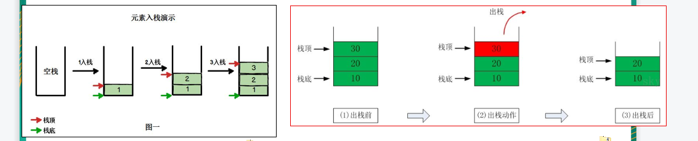
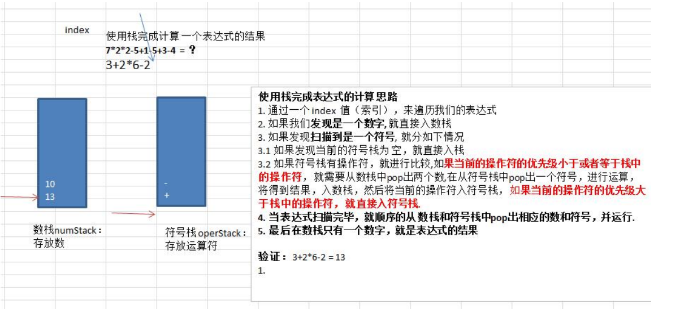

## 栈的介绍

1) 栈的英文为(stack)
2) 栈是一个先入后出(FILO-First In Last Out)的有序列表。
3) 栈(stack)是限制线性表中元素的插入和删除只能在线性表的同一端进行的一种特殊线性表。允许插入和删除的一端，为变化的一端，称为栈顶(Top)，另一端为固定的一端，称为栈底(Bottom)。
4) 根据栈的定义可知，最先放入栈中元素在栈底，最后放入的元素在栈顶，而删除元素刚好相反，最后放入的元素最先删除，最先放入的元素最后删除
5) 出栈(pop)和入栈(push)的概念

  

### 栈的应用场景

1) 子程序的调用：在跳往子程序前，会先将下个指令的地址存到堆栈中，直到子程序执行完后再将地址取出，以回到原来的程序中。 	
2) 处理递归调用：和子程序的调用类似，只是除了储存下一个指令的地址外，也将参数、区域变量等数据存入堆栈中。
3) 表达式的转换[中缀表达式转后缀表达式]与求值(实际解决)。
4) 二叉树的遍历。
5) 图形的深度优先(depth一first)搜索法。


### 栈的快速入门
1) 用数组模拟栈的使用，由于栈是一种有序列表，可以使用数组的结构来储存栈的数据内容，出栈，入栈等操作。


 #### 代码实现
 ````java
class ArrayStack {
    private int maxSize; // 栈的大小
    private int[] stack; // 数组，数组模拟栈，数据就放在该数组
    private int top = -1;// top表示栈顶，初始化为-1

    public ArrayStack(int maxSize){
        this.maxSize = maxSize;
        stack= new int[maxSize];
    }

    boolean isEmpty(){
        return this.top == -1;
    }

    boolean isFull(){
        return top ==  maxSize;
    }

    public void  push(int value){
        if (isFull()){
            System.out.println("数据已满");
            return;
        }
        top++;
        stack[top] = value;
    }


    public int  pop(){
        if(isEmpty()) {
            throw new RuntimeException("栈空，没有数据~");
        }
        return stack[top--];
    }

    public void list() {
        if(isEmpty()) {
            System.out.println("栈空，没有数据~~");
            return;
        }
        //需要从栈顶开始显示数据
        for(int i = top; i >= 0 ; i--) {
            System.out.printf("stack[%d]=%d\n", i, stack[i]);
        }
    }
````

### 前缀、中缀、后缀表达式(逆波兰表达式)

#### 前缀表达式(波兰表达式
   1) 缀表达式又称波兰式，前缀表达式的运算符位于操作数之前
   2) 举例说明： (3+4)×5-6 对应的前缀表达式就是 - × + 3 4 5 6
#### 前缀表达式的计算机求值   

从右至左扫描表达式，遇到数字时，将数字压入堆栈，遇到运算符时，弹出栈顶的两个数，用运算符对它们做相应的计算（栈顶元素 和 次顶元素），并将结果入栈；重复上述过程直到表达式最左端，最后运算得出的值即为表达式的结果

例如: (3+4)×5-6 对应的前缀表达式就是 - × + 3 4 5 6 , 针对前缀表达式求值步骤如下:

1) 从右至左扫描，将6、5、4、3压入堆栈
2) 遇到+运算符，因此弹出3和4（3为栈顶元素，4为次顶元素），计算出3+4的值，得7，再将7入栈
3) 接下来是×运算符，因此弹出7和5，计算出7×5=35，将35入栈
4) 最后是-运算符，计算出35-6的值，即29，由此得出最终结果

#### 中缀表达式
1) 中缀表达式就是常见的运算表达式，如(3+4)×5-6

2) 中缀表达式的求值是我们人最熟悉的，但是对计算机来说却不好操作(前面我们讲的案例就能看的这个问题)，因此，在计算结果时，往往会将中缀表达式转成其它表达式来操作(一般转成后缀表达式.)

  

 * 栈实现综合计算器(中缀表达式)

````java
package com.atguigu.stack;

import java.util.StringTokenizer;

public class Calculator {

    public static void main(String[] args) {
        String expression = "7*2*2-5+1-15+13-14"; // 15//如何处理多位数的问题？
        //创建两个栈，数栈，一个符号栈
        ArrayStack2 numStack = new ArrayStack2(10);
        ArrayStack2 operStack = new ArrayStack2(10);

        //定义需要的相关变量
        int index = 0;//用于扫描
        String keepNum = ""; //用于拼接 多位数
        while (true){
            if (index == expression.length()){
                break;
            }
            char val = expression.substring(index,index+1).charAt(0);
            if (!operStack.isOper(val)){
                keepNum += val;
                if (index == expression.length() - 1) {
                    numStack.push(Integer.parseInt(keepNum));
                }else{

                    //判断下一个字符是不是数字，如果是数字，就继续扫描，如果是运算符，则入栈
                    //注意是看后一位，不是index++
                    if (operStack.isOper(expression.substring(index+1,index+2).charAt(0))) {
                        //如果后一位是运算符，则入栈 keepNum = "1" 或者 "123"
                        numStack.push(Integer.parseInt(keepNum));
                        //重要的!!!!!!, keepNum清空
                        keepNum = "";
                    }
                }
            }else {
               if(operStack.isEmpty()){
                   operStack.push(val);
               }else {
                   if (operStack.priority(val) <= operStack.priority(operStack.peek())){
                        int num1 =  numStack.pop();
                        int num2 =  numStack.pop();
                        int oper = operStack.pop();
                        int  sum =  operStack.cal(num1,num2,oper);
                        numStack.push(sum);
                        operStack.push(val);
                   }else {
                       operStack.push(val);
                   }
               }
            }
            index++;
        }
        while (true){
            if(operStack.isEmpty()) {
                break;
            }
            int oper =  operStack.pop();
            int num1 = numStack.pop();
            int num2 = numStack.pop();
            int result =  operStack.cal(num1,num2,oper);
            numStack.push(result);
        }

        //将数栈的最后数，pop出，就是结果
        int res2 = numStack.pop();
        System.out.printf("表达式 %s = %d", expression, res2);

    }
}

class ArrayStack2 {
    private int maxSize; // 栈的大小
    private int[] stack; // 数组，数组模拟栈，数据就放在该数组
    private int top = -1;


    //构造器
    public ArrayStack2(int maxSize) {
        this.maxSize = maxSize;
        stack = new int[this.maxSize];
    }

    //增加一个方法，可以返回当前栈顶的值, 但是不是真正的pop
    public int peek() {
        return stack[top];
    }

    //栈满
    public boolean isFull() {
        return top == maxSize - 1;
    }
    //栈空
    public boolean isEmpty() {
        return top == -1;
    }
    //入栈-push
    public void push(int value) {
        //先判断栈是否满
        if(isFull()) {
            System.out.println("栈满");
            return;
        }
        top++;
        stack[top] = value;
    }
    //出栈-pop, 将栈顶的数据返回
    public int pop() {
        //先判断栈是否空
        if(isEmpty()) {
            //抛出异常
            throw new RuntimeException("栈空，没有数据~");
        }
        int value = stack[top];
        top--;
        return value;
    }

    public int priority(int oper) {
        if(oper == '*' || oper == '/'){
            return 1;
        } else if (oper == '+' || oper == '-') {
            return 0;
        } else {
            return -1; // 假定目前的表达式只有 +, - , * , /
        }
    }

    public  boolean isOper(char val){
        return val == '+' || val == '-' || val == '*' || val == '/';
    }

    //计算方法
    public int cal(int num1, int num2, int oper) {
        int res = 0; // res 用于存放计算的结果
        switch (oper) {
            case '+':
                res = num1 + num2;
                break;
            case '-':
                res = num2 - num1;// 注意顺序
                break;
            case '*':
                res = num1 * num2;
                break;
            case '/':
                res = num2 / num1;
                break;
            default:
                break;
        }
        return res;
    }

    //显示栈的情况[遍历栈]， 遍历时，需要从栈顶开始显示数据
    public void list() {
        if(isEmpty()) {
            System.out.println("栈空，没有数据~~");
            return;
        }
        //需要从栈顶开始显示数据
        for(int i = top; i >= 0 ; i--) {
            System.out.printf("stack[%d]=%d\n", i, stack[i]);
        }
    }

}


````

#### 后缀表达式(逆波兰计算器)
1) 后缀表达式又称逆波兰表达式,与前缀表达式相似，只是运算符位于操作数之后

2) 中举例说明： (3+4)×5-6 对应的后缀表达式就是 3 4 + 5 × 6 –

  

#### 后缀表达式的计算机求值
例如: (3+4)×5-6 对应的后缀表达式就是 3 4 + 5 × 6 - , 针对后缀表达式求值步骤如下
1) 从左至右扫描，将 3 和 4 压入堆栈； 
2) 遇到+运算符，因此弹出 4 和 3（4 为栈顶元素，3 为次顶元素），计算出 3+4 的值，得 7，再将 7 入栈； 
3) 将 5 入栈； 
4) 接下来是×运算符，因此弹出 5 和 7，计算出 7×5=35，将 35 入栈； 
5) 将 6 入栈； 
6) 最后是-运算符，计算出 35-6 的值，即 29，由此得出最终结果

#### 后缀表达式计算器实现
````java
package com.atguigu.stack;

import java.util.ArrayList;
import java.util.List;
import java.util.Stack;

public class PolandNotation {

    public static void main(String[] args) {


        //完成将一个中缀表达式转成后缀表达式的功能
        //说明
        //1. 1+((2+3)×4)-5 => 转成  1 2 3 + 4 × + 5 –
        //2. 因为直接对str 进行操作，不方便，因此 先将  "1+((2+3)×4)-5" =》 中缀的表达式对应的List
        //   即 "1+((2+3)×4)-5" => ArrayList [1,+,(,(,2,+,3,),*,4,),-,5]
        //3. 将得到的中缀表达式对应的List => 后缀表达式对应的List
        //   即 ArrayList [1,+,(,(,2,+,3,),*,4,),-,5]  =》 ArrayList [1,2,3,+,4,*,+,5,–]

        String expression = "1+((2+3)*4)-5";//注意表达式
        List<String> infixExpressionList = toInfixExpressionList(expression);
        System.out.println("中缀表达式对应的List=" + infixExpressionList); // ArrayList [1,+,(,(,2,+,3,),*,4,),-,5]
        List<String> suffixExpreesionList = parseSuffixExpreesionList(infixExpressionList);
        System.out.println("后缀表达式对应的List" + suffixExpreesionList); //ArrayList [1,2,3,+,4,*,+,5,–]

        System.out.printf("expression=%d", calculate(suffixExpreesionList)); // ?

        System.out.println();

		/*

		//先定义给逆波兰表达式
		//(30+4)×5-6  => 30 4 + 5 × 6 - => 164
		// 4 * 5 - 8 + 60 + 8 / 2 => 4 5 * 8 - 60 + 8 2 / +
		//测试
		//说明为了方便，逆波兰表达式 的数字和符号使用空格隔开
		//String suffixExpression = "30 4 + 5 * 6 -";
		String suffixExpression = "4 5 * 8 - 60 + 8 2 / +"; // 76
		//思路
		//1. 先将 "3 4 + 5 × 6 - " => 放到ArrayList中
		//2. 将 ArrayList 传递给一个方法，遍历 ArrayList 配合栈 完成计算

		List<String> list = getListString(suffixExpression);
		System.out.println("rpnList=" + list);
		int res = calculate(list);
		System.out.println("计算的结果是=" + res);

		*/
    }
    public static int calculate(List<String> ls) {
        // 创建给栈, 只需要一个栈即可
        Stack<String> stack = new Stack<String>();
        // 遍历 ls
        for (String item : ls) {
            // 这里使用正则表达式来取出数
            if (item.matches("\\d+")) { // 匹配的是多位数
                // 入栈
                stack.push(item);
            } else {
                // pop出两个数，并运算， 再入栈
                int num2 = Integer.parseInt(stack.pop());
                int num1 = Integer.parseInt(stack.pop());
                int res = 0;
                if (item.equals("+")) {
                    res = num1 + num2;
                } else if (item.equals("-")) {
                    res = num1 - num2;
                } else if (item.equals("*")) {
                    res = num1 * num2;
                } else if (item.equals("/")) {
                    res = num1 / num2;
                } else {
                    throw new RuntimeException("运算符有误");
                }
                //把res 入栈
                stack.push("" + res);
            }

        }
        //最后留在stack中的数据是运算结果
        return Integer.parseInt(stack.pop());
    }

    public static List<String> parseSuffixExpreesionList(List<String> ls) {
        Stack<String> s1 = new Stack<>();
        List<String> s2 = new ArrayList<>();

        for (String str : ls) {
            if (str.matches("\\d+")) {
                s2.add(str);
            } else if (s1.empty() || str.equals("(")) {
                s1.add(str);
            } else if (str.equals(")")) {
                while (!s1.peek().equals("(")) {
                    s2.add(s1.pop());
                }
                s1.pop();
            } else {
                //当item的优先级小于等于s1栈顶运算符, 将s1栈顶的运算符弹出并加入到s2中，再次转到(4.1)与s1中新的栈顶运算符相比较
                //问题：我们缺少一个比较优先级高低的方法
                while(s1.size() != 0 && Operation.getValue(s1.peek()) >= Operation.getValue(str) ) {
                    s2.add(s1.pop());
                }
                //还需要将item压入栈
                s1.push(str);
            }
        }
        while (!s1.isEmpty()){
            s2.add(s1.pop());
        }
        return s2;
    }

    //方法：将 中缀表达式转成对应的List
    //  s="1+((2+3)×4)-5";
    public static List<String> toInfixExpressionList(String s) {
        List<String> stringList = new ArrayList<>();

        String num = "";
        for (int i = 0; i < s.length(); i++) {
            String str = s.substring(i, i + 1);
            if (str.matches("\\d")) {
                num = num + str;
                 if(i != s.length()-1 && s.substring(i+1,i+2).matches("\\d")){
                 }else {
                     if (!num.equals("")) {
                         stringList.add(num);
                     } else {
                         stringList.add(str);
                     }
                     num = "";
                 }
            } else {
                stringList.add(s.substring(i, i + 1));
            }
        }
        return  stringList;
    }
}

//编写一个类 Operation 可以返回一个运算符 对应的优先级
class Operation {
    private static int ADD = 1;
    private static int SUB = 1;
    private static int MUL = 2;
    private static int DIV = 2;

    //写一个方法，返回对应的优先级数字
    public static int getValue(String operation) {
        int result = 0;
        switch (operation) {
            case "+":
                result = ADD;
                break;
            case "-":
                result = SUB;
                break;
            case "*":
                result = MUL;
                break;
            case "/":
                result = DIV;
                break;
            default:
                System.out.println("不存在该运算符" + operation);
                break;
        }
        return result;
    }

}
````
