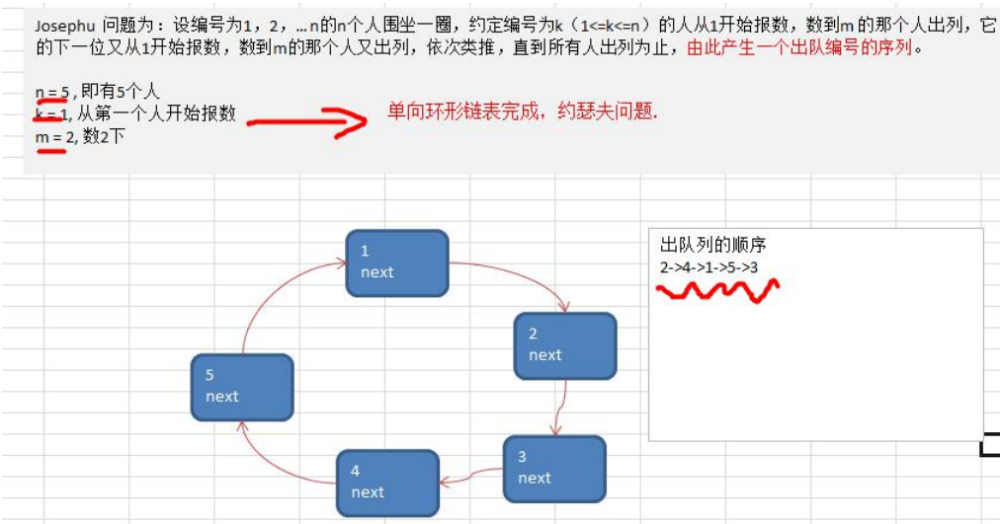
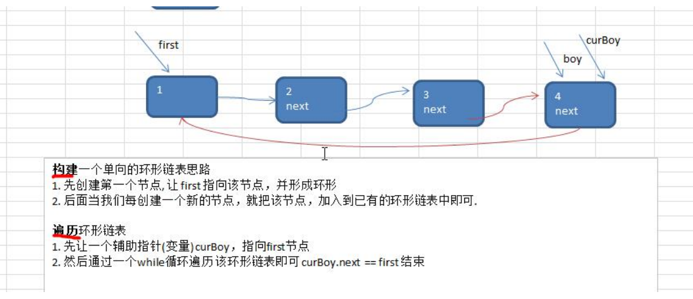
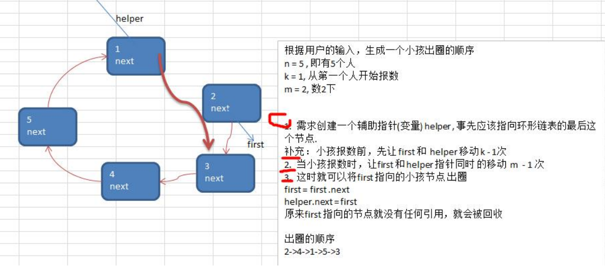

### Josephu(约瑟夫、约瑟夫环)  问题
Josephu  问题为：设编号为1，2，… n的n个人围坐一圈，约定编号为k（1<=k<=n）的人从1开始报数，数到m 的那个人出列，它的下一位又从1开始报数，数到m的那个人又出列，依次类推，直到所有人出列为止，由此产生一个出队编号的序列。

  

### 约瑟夫问题-创建环形链表的思路图解
  

### 约瑟夫问题-小孩出圈的思路分析图

  

 #### 代码实现

 ````java
package com.atguigu.linkedlist;

public class Josepfu {

    public static void main(String[] args) {
        // 测试一把看看构建环形链表，和遍历是否ok
        CircleSingleLinkedList circleSingleLinkedList = new CircleSingleLinkedList();
        circleSingleLinkedList.addBoy(5);// 加入5个小孩节点
        circleSingleLinkedList.showBoy();

        circleSingleLinkedList.countBoy(1,2,5);
    }

}


class CircleSingleLinkedList {
    // 创建一个first节点,当前没有编号
    private Boy first = null;

    public void addBoy(int nums) {
        // nums 做一个数据校验
        if (nums < 1) {
            System.out.println("nums的值不正确");
            return;
        }
        Boy cur = null;
        for (int i = 1; i <= nums ; i++) {
            Boy boy = new Boy(i);
            if( i == 1){
                first = boy;
                first.setNext(boy);
            }else {
                cur.setNext(boy);
                boy.setNext(first);
            }
            cur = boy;
        }

    }

    // 根据用户的输入，计算出小孩出圈的顺序
    /**
     *
     * @param startNo
     *            表示从第几个小孩开始数数
     * @param countNum
     *            表示数几下
     * @param nums
     *            表示最初有多少小孩在圈中
     */
    public void countBoy(int startNo, int countNum, int nums) {
        // 先对数据进行校验
        if (first == null || startNo < 1 || startNo > nums) {
            System.out.println("参数输入有误， 请重新输入");
            return;
        }
        Boy  helper = first;
        while (true){
            if (helper.getNext() == first){
                break;
            }
            helper  = helper.getNext();
        }

        for (int i = 0; i<startNo - 1; i++){
            first = first.getNext();
            helper = helper.getNext();
        }

        while (true){
            if(helper == first) { //说明圈中只有一个节点
                break;
            }
            for (int i= 0; i < countNum - 1; i++){
                first = first.getNext();
                helper = helper.getNext();
            }
            System.out.printf("小孩%d出圈\n", first.getNo());
            first = first.getNext();
            helper.setNext(first);
        }
        System.out.printf("最后留在圈中的小孩编号%d \n", first.getNo());

    }

    // 遍历当前的环形链表
    public void showBoy() {
        // 判断链表是否为空
        if (first == null) {
            System.out.println("没有任何小孩~~");
            return;
        }
        // 因为first不能动，因此我们仍然使用一个辅助指针完成遍历
        Boy curBoy = first;
        while (true) {
            System.out.printf("小孩的编号 %d \n", curBoy.getNo());
            if (curBoy.getNext() == first) {// 说明已经遍历完毕
                break;
            }
            curBoy = curBoy.getNext(); // curBoy后移
        }
    }

}
// 创建一个Boy类，表示一个节点
class Boy {
    private int no;// 编号
    private Boy next; // 指向下一个节点,默认null

    public Boy(int no) {
        this.no = no;
    }

    public int getNo() {
        return no;
    }

    public void setNo(int no) {
        this.no = no;
    }

    public Boy getNext() {
        return next;
    }

    public void setNext(Boy next) {
        this.next = next;
    }

}
 ````
