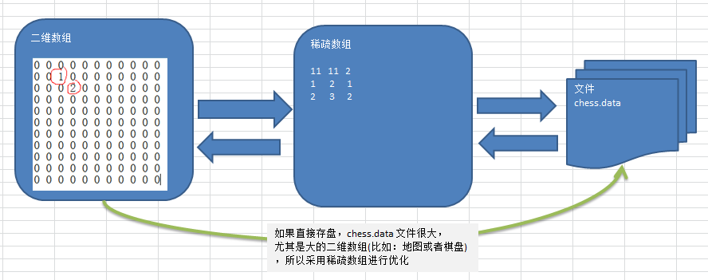

## 稀疏数组

当一个数组中大部分元素为０，或者为同一个值的数组时，可以使用稀疏数组来保存该数组。 
稀疏数组的处理方法是: 
1) 记录数组一共有几行几列，有多少个不同的值 
2) 把具有不同值的元素的行列及值记录在一个小规模的数组中，从而缩小程序的规模

 

## 应用实例
1) 使用稀疏数组，来保留类似前面的二维数组(棋盘、地图等等)
2) 把稀疏数组存盘，并且可以从新恢复原来的二维数组数
3) 整体思路分析


二维数组转换稀疏数组的思路
------
* 先创建一个二维数组，row长度为原数组值sum+1，列长度为3
* 第一行记录原数组的row和col长度，value的总数
* 其他行 1列记录原数组的row下标, 2列记录原数组的col下标, 3列记录值

稀疏数组转换二维数组的思路
------
 * 先读取稀疏数组的第一行，根据第一行的数组创建原始的二维数组
 * 在读取稀疏数组后几行的数据，并赋值给原始的二维数组即可

## 代码示例
````java
package com.atguigu.sparsearray;

public class SparseArray {


    /**
     * 二维数组转换稀疏数组的思路
     * 1. 先创建一个二维数组，row长度为原数组值sum+1，列长度为3
     * 2. 第一行记录原数组的row和col长度，value的总数
     * 1) 列记录原数组的row下标
     * 2) 列记录原数组的col下标
     * 3) 记录值
     */
    public static void main(String[] args) {
        // 创建一个原始的二维数组 11 * 11
        int[][] chessArr1 = new int[11][11];
        chessArr1[1][2] = 4;
        chessArr1[4][2] = 2;
        chessArr1[2][6] = 1;
        chessArr1[7][6] = 23;

        System.out.println("遍历二维数组");
        print(chessArr1);
        //循环遍历二维数组累计值不为0的sum
        int sumVal = 0;
        for (int[] row : chessArr1) {
            for (int val : row) {
                 if(val!=0) sumVal++;
            }
        }

        //创建稀疏数组
        int[][] sparseArray = new int[sumVal+1][3];
        sparseArray[0][0] = 11;
        sparseArray[0][1] = 11;
        sparseArray[0][2] = sumVal;

        //复制到稀疏数组
        int sumIndex=0;
        for (int i=0; i<chessArr1.length;i++){
            for (int j = 0; j < chessArr1[i].length; j++) {
                 if(chessArr1[i][j]!=0){
                     sumIndex++;
                     sparseArray[sumIndex][0]=i;
                     sparseArray[sumIndex][1]=j;
                     sparseArray[sumIndex][2]=chessArr1[i][j];
                 }
            }
        }

        System.out.println("得到的稀疏数组");
        print(sparseArray);


        // 把稀疏数组转换为二维数组
        int row = sparseArray[0][0];
        int col = sparseArray[0][1];
        int[][] chessArr2 = new int[row][col];


        /**
         * 先读取稀疏数组的第一行，根据第一行的数组创建原始的二维数组
         * 在读取稀疏数组后几行的数据，并赋值给原始的二维数组即可
         */
        for (int i = 1; i <sparseArray.length ; i++) {
            int row_index = sparseArray[i][0];
            int col_index = sparseArray[i][1];
            chessArr2[row_index][col_index]= sparseArray[i][2];
        }

        System.out.println("转换后的二维数组");
        print(chessArr2);

    }


    static void  print(int[][] array){
        for (int[] row : array) {
            for (int val : row) {
                System.out.printf("%d\t",val);
            }
            System.out.println();
        }
    }

}
````
