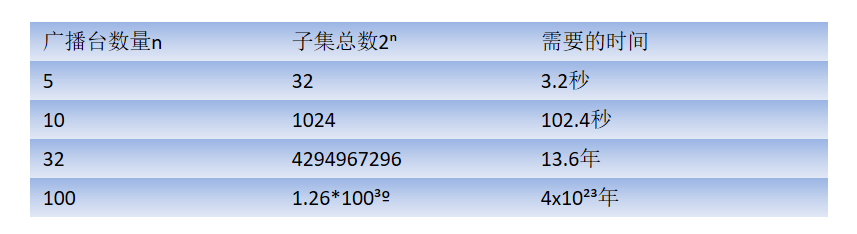
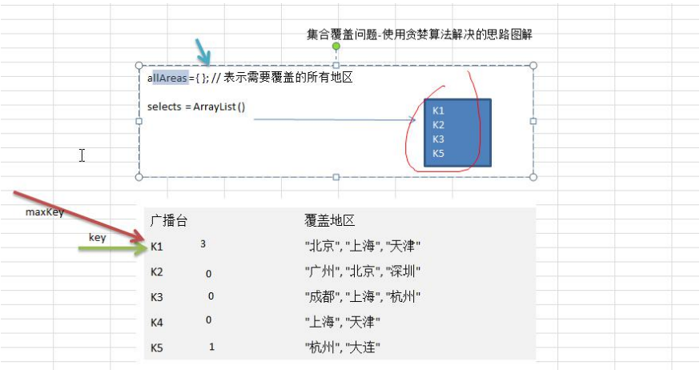

## 贪心算法介绍

1) 贪婪算法(贪心算法)是指在对问题进行求解时，在每一步选择中都采取最好或者最优(即最有利)的选择，从而希望能够导致结果是最好或者最优的算法

2) 贪婪算法所得到的结果不一定是最优的结果(有时候会是最优解)，但是都是相对近似(接近)最优解的结果

## 应用场景-集合覆盖问题

假设存在下面需要付费的广播台，以及广播台信号可以覆盖的地区。 如何选择最少的广播台，让所有的地区都可以接收到信号

|广播台 |	覆盖地区|
--------|-------------
K1	| 北京 上海 天津|
K2	| 广州 北京 深圳
K3	| 成都 上海 杭州
K4	| 上海 天津
K5	| 杭州 大连

## 思路分析
如何找出覆盖所有地区的广播台的集合呢，使用穷举法实现,列出每个可能的广播台的集合，这被称为幂集。假设总的有n个广播台，则广播台的组合总共有2ⁿ -1 个,假设每秒可以计算10个子集， 如图:

   


## 使用贪婪算法，效率高
1) 目前并没有算法可以快速计算得到准备的值， 使用贪婪算法，则可以得到非常接近的解，并且效率高。选择 策略上，因为需要覆盖全部地区的最小集合: 
2) 遍历所有的广播电台, 找到一个覆盖了最多未覆盖的地区的电台(此电台可能包含一些已覆盖的地区，但没有关 系） 
3) 将这个电台加入到一个集合中(比如 ArrayList), 想办法把该电台覆盖的地区在下次比较时去掉。
4) 重复第 1 步直到覆盖了全部的地区

## 贪心算法注意事项和细节
1) 贪婪算法所得到的结果不一定是最优的结果(有时候会是最优解)，但是都是相对近似(接近)最优解的结果
2) 比如上题的算法选出的是K1, K2, K3, K5，符合覆盖了全部的地区
3) 但是我们发现 K2, K3,K4,K5 也可以覆盖全部地区，如果K2 的使用成本低于K1,那么我们上题的 K1, K2, K3, K5 虽然是满足条件，但是并不是最优的.

    

````java

````