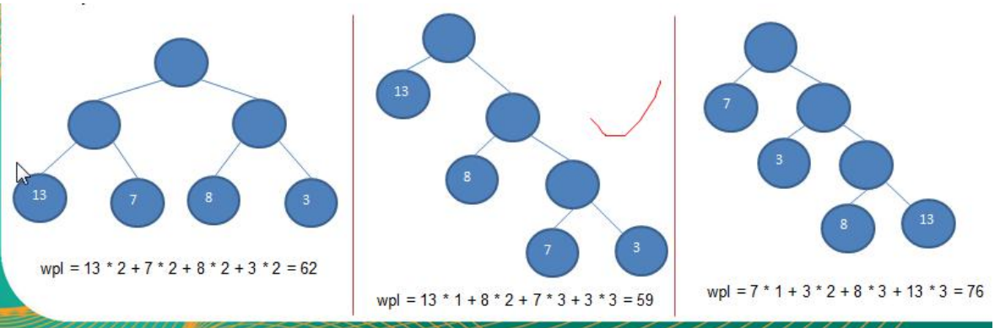
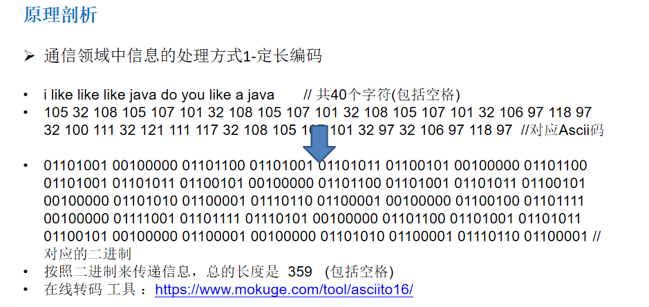
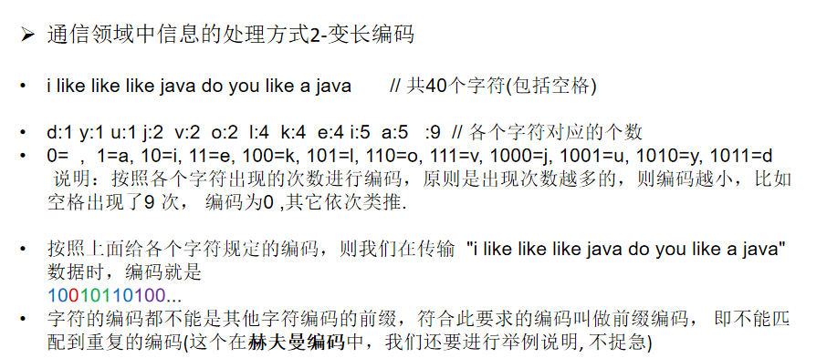
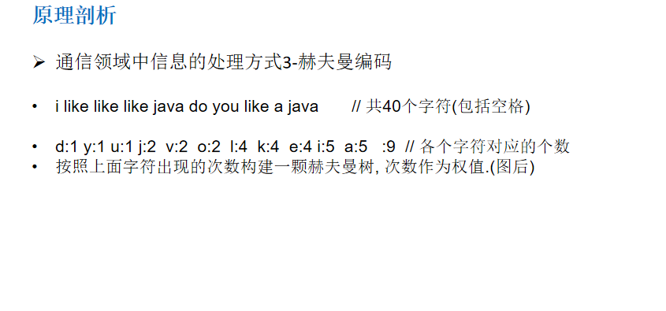

赫夫曼树
====

## 基本介绍
1) 给定 n 个权值作为 n 个叶子结点，构造一棵二叉树，若该树的带权路径长度(wpl)达到最小，称这样的二叉树为 最优二叉树，也称为哈夫曼树(Huffman Tree), 还有的书翻译为霍夫曼树。 
2) 赫夫曼树是带权路径长度最短的树，权值较大的结点离根较近

## 赫夫曼树几个重要概念和举例说明
1) 路径和路径长度：在一棵树中，从一个结点往下可以达到的孩子或孙子结点之间的通路，称为路径。通路中分支的数目称为路径长度。若规定根结点的层数为1，则从根结点到第L层结点的路径长度为L-1
2) 结点的权及带权路径长度：若将树中结点赋给一个有着某种含义的数值，则这个数值称为该结点的权。结点的带权路径长度为：从根结点到该结点之间的路径长度与该结点的权的乘积
3) 树的带权路径长度：树的带权路径长度规定为所有叶子结点的带权路径长度之和，记为WPL(weighted path length) ,权值越大的结点离根结点越近的二叉树才是最优二叉树。
4) WPL最小的就是赫夫曼树

    
 
## 赫夫曼树创建思路图解
1) 从小到大进行排序, 将每一个数据，每个数据都是一个节点 ， 每个节点可以看成是一颗最简单的二叉树 
2) 取出根节点权值最小的两颗二叉树 
3) 组成一颗新的二叉树, 该新的二叉树的根节点的权值是前面两颗二叉树根节点权值的和
4) 再将这颗新的二叉树，以根节点的权值大小 再次排序， 不断重复 1-2-3-4 的步骤，直到数列中，所有的数 据都被处理，就得到一颗赫夫曼树


### 代码示例
````java
public class HuffmanTree {

    public static void main(String[] args) {
        int arr[] = { 13, 7, 8, 3, 29, 6, 1 };
        Node root = createHuffmanTree(arr);

        //测试一把
        preOrder(root); //

    }

    //编写一个前序遍历的方法
    public static void preOrder(Node root) {
        if(root != null) {
            root.preOrder();
        }else{
            System.out.println("是空树，不能遍历~~");
        }
    }

    // 创建赫夫曼树的方法
    /**
     *
     * @param arr 需要创建成哈夫曼树的数组
     * @return 创建好后的赫夫曼树的root结点
     */
    public static Node createHuffmanTree(int[] arr) {
        // 第一步为了操作方便
        // 1. 遍历 arr 数组
        // 2. 将arr的每个元素构成成一个Node
        // 3. 将Node 放入到ArrayList中
        List<Node> nodes = new ArrayList<Node>();
        for (int value : arr) {
            nodes.add(new Node(value));
        }

        //我们处理的过程是一个循环的过程


        while(nodes.size() > 1) {

            //排序 从小到大
            Collections.sort(nodes);

            System.out.println("nodes =" + nodes);

            //取出根节点权值最小的两颗二叉树
            //(1) 取出权值最小的结点（二叉树）
            Node leftNode = nodes.get(0);
            //(2) 取出权值第二小的结点（二叉树）
            Node rightNode = nodes.get(1);

            //(3)构建一颗新的二叉树
            Node parent = new Node(leftNode.value + rightNode.value);
            parent.left = leftNode;
            parent.right = rightNode;

            //(4)从ArrayList删除处理过的二叉树
            nodes.remove(leftNode);
            nodes.remove(rightNode);
            //(5)将parent加入到nodes
            nodes.add(parent);
        }

        //返回哈夫曼树的root结点
        return nodes.get(0);

    }
}

// 创建结点类
// 为了让Node 对象持续排序Collections集合排序
// 让Node 实现Comparable接口
class Node implements Comparable<Node> {
    int value; // 结点权值
    char c; //字符
    Node left; // 指向左子结点
    Node right; // 指向右子结点

    //写一个前序遍历
    public void preOrder() {
        System.out.println(this);
        if(this.left != null) {
            this.left.preOrder();
        }
        if(this.right != null) {
            this.right.preOrder();
        }
    }

    public Node(int value) {
        this.value = value;
    }

    @Override
    public String toString() {
        return "Node [value=" + value + "]";
    }

    @Override
    public int compareTo(Node o) {
        // TODO Auto-generated method stub
        // 表示从小到大排序
        return this.value - o.value;
    }

}
````
## 赫夫曼编码
1) 赫夫曼编码也翻译为    哈夫曼编码(Huffman Coding)，又称霍夫曼编码，是一种编码方式, 属于一种程序算法
2) 赫夫曼编码是赫哈夫曼树在电讯通信中的经典的应用之一。
3) 赫夫曼编码广泛地用于数据文件压缩。其压缩率通常在20%～90%之间
5) 赫夫曼码是可变字长编码(VLC)的一种。Huffman于1952年提出一种编码方法，称之为最佳编码

###  原理
   
   
   

### 步骤
1) 从小到大进行排序, 将每一个数据，每个数据都是一个节点 ， 每个节点可以看成是一颗最简单的二叉树 
2) 取出根节点权值最小的两颗二叉树 
3) 组成一颗新的二叉树, 该新的二叉树的根节点的权值是前面两颗二叉树根节点权值的和 
4) 再将这颗新的二叉树，以根节点的权值大小 再次排序， 不断重复 1-2-3-4 的步骤，直到数列中，所有的数据都被处理， 就得到一颗赫夫曼树
  
5) 根据赫夫曼树，给各个字符,规定编码 (前缀编码)， 向左的路径为 0 向右的路径为 1 ， 编码 如下

   : o: 1000 u: 10010 d: 100110 y: 100111 i: 101 a : 110 k: 1110 e: 1111 j: 0000 v: 0001 l: 001 : 01 
6) 按照上面的赫夫曼编码，我们的"i like like like java do you like a java" 字符串对应的编码为 (注 意这里我们使用的无损压缩) 

   10101001101111011110100110111101111010011011110111101000011000011100110011110000110 01111000100100100110111101111011100100001100001110 通过赫夫曼编码处理 长度为 133 
7) 长度为 ： 133 说明: 原来长度是 359 , 压缩了 (359-133) / 359 = 62.9% 

### 代码示例
````java
````