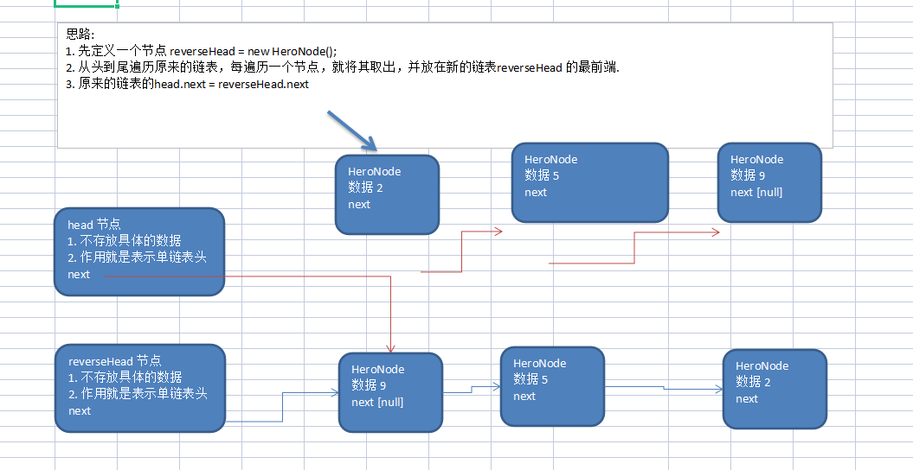

## 链表
链表是有序的列表，但是它在内存中是存储如下

  

1) 链表是以节点的方式来存储,是链式存储
2) 每个节点包含 data 域， next 域：指向下一个节点.
3) 如图：发现链表的各个节点不一定是连续存储.
4) 链表分带头节点的链表和没有头节点的链表，根据实际的需求来确定

### 单链表
 1) 队列本身是有序列表，若使用数组的结构来存储队列的数据，则队列数组的声明如下图, 其中 maxSize 是该队 列的最大容量
 2) 因为队列的输出、输入是分别从前后端来处理，因此需要两个变量 front 及 rear 分别记录队列前后端的下标， front 会随着数据输出而改变，而 rear 则是随着数据输入而改变，如图所示

   

### 单链表的应用实例
使用带head头的单向链表实现 –水浒英雄排行榜管理
* 完成对英雄人物的增删改查操作
* 第一种方法在添加英雄时，直接添加到链表的尾部
* 第二种方式在添加英雄时，根据排名将英雄插入到指定位置(如果有这个排名，则添加失 败，并给出提示)


 #### 代码实现
 ````java
package com.atguigu.linkedlist;

public class SingleLinkedListDemo {

    public static void main(String[] args) {
        Node hero1 = new Node(1, "宋江", "及时雨");
        Node hero2 = new Node(2, "卢俊义", "玉麒麟");
        Node hero3 = new Node(3, "吴用", "智多星");
        Node hero4 = new Node(4, "林冲", "豹子头");
        Node hero5 = new Node(5, "林冲", "豹子头");

        SingleLinkedList singleLinkedList = new SingleLinkedList();

        singleLinkedList.addOrderBy(hero5);
        singleLinkedList.addOrderBy(hero3);
        singleLinkedList.addOrderBy(hero4);
        singleLinkedList.addOrderBy(hero2);
        singleLinkedList.addOrderBy(hero1);

        singleLinkedList.list();

        reversetList(singleLinkedList.getHead());

        System.out.println("------------------------------");

        singleLinkedList.list();
    }

    public static void reversetList(Node head) {
        if(head.next == null || head.next.next == null){
            return;
        }

        Node cur = head.next;
        Node reverseHead= new Node(0, "", "");

        while (cur != null){
            Node nex = cur.next;
            cur.next =  reverseHead.next;
            reverseHead.next = cur;
            cur = nex;
        }

        head.next = reverseHead.next;

    }

}

class SingleLinkedList {
    private Node head = new Node(0, "", "");

    //添加节点到单向链表
    //思路，当不考虑编号顺序时
    //1. 找到当前链表的最后节点
    //2. 将最后这个节点的next 指向 新的节点
    void addNode(Node heroNode) {
        //因为head节点不能动，因此我们需要一个辅助遍历 temp
        Node temp = head;
        //遍历链表，找到最后
        while(true) {
            //找到链表的最后
            if(temp.next == null) {//
                break;
            }
            //如果没有找到最后, 将将temp后移
            temp = temp.next;
        }
        //当退出while循环时，temp就指向了链表的最后
        //将最后这个节点的next 指向 新的节点
        temp.next = heroNode;
    }

     public Node  getHead(){
        return head;
    }

    void addOrderBy(Node heroNode) {
        Node temp = head;

        boolean flag =false;
        do {
            if(temp.next == null || temp.next.no > heroNode.no){
                break;
            }
            if(temp.next.no == heroNode.no){
                flag= true;
                break;
            }

        }while ((temp = temp.next) != null);

        if(!flag){
            heroNode.next =temp.next;
            temp.next = heroNode;
        }else {
            System.out.printf("准备插入的英雄的编号 %d 已经存在了, 不能加入\n", heroNode.no);
        }


    }

    //修改节点的信息, 根据no编号来修改，即no编号不能改.
    //说明
    //1. 根据 newHeroNode 的 no 来修改即可
    public void update(Node newHeroNode) {
        //判断是否空
        if(head.next == null) {
            System.out.println("链表为空~");
            return;
        }
        //找到需要修改的节点, 根据no编号
        //定义一个辅助变量
        Node temp = head.next;
        boolean flag = false; //表示是否找到该节点
        while(true) {
            if (temp == null) {
                break; //已经遍历完链表
            }
            if(temp.no == newHeroNode.no) {
                //找到
                flag = true;
                break;
            }
            temp = temp.next;
        }
        //根据flag 判断是否找到要修改的节点
        if(flag) {
            temp.name = newHeroNode.name;
            temp.nickname = newHeroNode.nickname;
        } else { //没有找到
            System.out.printf("没有找到 编号 %d 的节点，不能修改\n", newHeroNode.no);
        }
    }

    //删除节点
    //思路
    //1. head 不能动，因此我们需要一个temp辅助节点找到待删除节点的前一个节点
    //2. 说明我们在比较时，是temp.next.no 和  需要删除的节点的no比较
    public void del(int no) {
        Node temp = head;
        boolean flag = false; // 标志是否找到待删除节点的
        while(true) {
            if(temp.next == null) { //已经到链表的最后
                break;
            }
            if(temp.next.no == no) {
                //找到的待删除节点的前一个节点temp
                flag = true;
                break;
            }
            temp = temp.next; //temp后移，遍历
        }
        //判断flag
        if(flag) { //找到
            //可以删除
            temp.next = temp.next.next;
        }else {
            System.out.printf("要删除的 %d 节点不存在\n", no);
        }
    }


    void list() {
        if(head.next == null) {
            System.out.println("链表为空");
            return;
        }
        Node temp = this.head.next;
        do {
            System.out.println(temp.toString());
        } while ((temp = temp.next) != null);

    }

}

class Node {
    public int no;
    public String name;
    public String nickname;
    Node next;


    public Node(int no, String name, String nickname) {
        this.no = no;
        this.name = name;
        this.nickname = nickname;
    }

    @Override
    public String toString() {
        return "Node{" +
                "no=" + no +
                ", name='" + name + '\'' +
                ", nickname='" + nickname + '\'' +
                '}';
    }
}
 ````

#### 单链表的反转

思路分析图解

 

````java
    public static void reversetList(Node head) {
        if(head.next == null || head.next.next == null){
            return;
        }

        Node cur = head.next;
        Node reverseHead= new Node(0, "", "");

        while (cur != null){
            Node nex = cur.next;
            cur.next =  reverseHead.next;
            reverseHead.next = cur;
            cur = nex;
        }

        head.next = reverseHead.next;

    }
````
 #### 合并两个有序的单链表，合并之后的链表依然有序

 ````java
 
 ````
 
