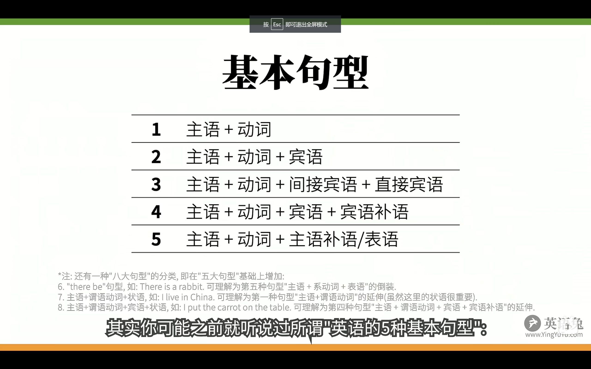

## 英语语法构成
 主语（人/物） + 谓语（动作/发生了什么事）

### 有哪些"动作"（动词）？
1.可以独立完成的动作:**不及物动词** \
 **主语 ＋（不及物）动词** 

 `papa rabbit sleeps. 兔老爹睡觉`

2.有一个动作的承受者:**单及物动词**\
主语＋（及物）动词＋宾语

`papa rabbit lives you.` 兔老爹喜欢你

3.有两个动作承受者:**双及物动词**\
主语＋ 双及物动词 ＋间宾宾语＋直接宾语宾

`papa rabbit teaches you english` 兔老爹教你英语

4.只有一个动作承受者（不同于2）:混合及物动词\
主语＋（复杂及物）动词＋宾语＋（宾语）补语

`papa rabbit considers you smart` 兔老爹认为你聪明

5.不是个"动作":（连）系动词\
主语 ＋ （系）动词＋（主语）补语

`papa rabbit is tall` 兔老爹是高的  把tall 赋给前面的主语

    